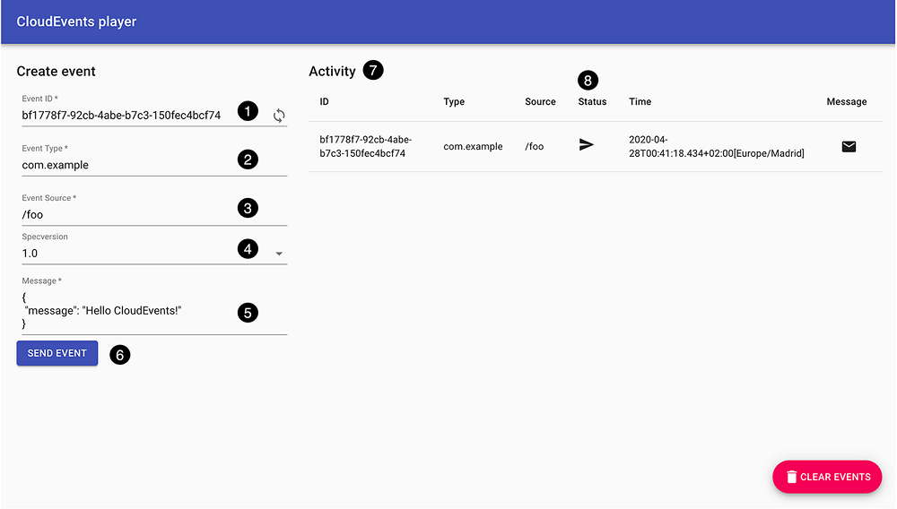

# Chapter 6 Introduction to Eventing
## 6.4 A walkthrough
In chapter 2, it didn’t take me long to get to the hallowed “Hello world” moment. Getting there with Eventing will be a slightly longer way around. I’ll start by turning to my trusty companion, kn, to tell me the current state of play, as the following listing demonstrates.

Listing 6.7 Whaddya know?
```bash
$ kn trigger list && kn source list && kn broker list
No triggers found.
No sources found in default namespace.
No brokers found.
```
Under the hood, these commands are groping around for Trigger, Source, and Broker records in Kubernetes. I haven’t done anything yet, so there are none.

So far, not very enlightening. Especially because it’s been a few chapters since I last committed these Triggers and Sources onto a page. Let’s refresh: a Trigger combines information about an event filter and an event subscriber together; a Source is a description of something that can create events.

Let’s work backwards, starting with a Subscriber. The simplest thing to put here is a basic web app that can receive CloudEvents and perhaps help us to inspect those. Luckily, helpful folks have already done so for us. Just as luckily, kn makes it easy to enjoy their work. I’m going to start by setting up a Broker and then adding the cloudevent-player as in the following listing.

Listing 6.8 Adding a Broker and installing cloudevent-player with kn
```bash
$ kn broker create default
Broker 'default' successfully created in namespace 'default'.
 
$ kn service create cloudevents-player \
>     --image ruromero/cloudevents-player:latest \
>     --env BROKER_URL=http://default
Creating service 'cloudevents-player' in namespace 'default':

  0.091s The Route is still working to reflect the latest desired specification.
  0.103s ...
  0.131s Configuration "cloudevents-player" is waiting for a Revision to become ready.
 21.863s ...
 21.941s Ingress has not yet been reconciled.
 22.034s Waiting for load balancer to be ready
 22.251s Ready to serve.

Service 'cloudevents-player' created to latest revision 'cloudevents-player-00001' is available at URL:
http://cloudevents-player.default.192.168.59.201.sslip.io
```
This is a handy little web app I can use to send and receive CloudEvents. If you open the URL, you should see a form and then some blank space. I’m going to go ahead and enter an event for you, send it, and then discuss a screenshot.

  
Figure 6.4 The CloudEvents player app

Figure 6.4 shows the CloudEvents player interface, which has a number of useful landmarks:

1. Here’s the event ID. There’s a handy autogenerator, just click the Loop icon (🔁).

2. Here’s an event type.

3. And the event source.

4. The ``Specversion`` can be altered, but shouldn’t be. This made sense when CloudEvents was an evolving specification, but that’s no longer the case.

5. The Message here is actually the ``data`` section of the message.

6. Clicking Send Event creates an event, which is sent to a broker (more in a second).

7. The Activity table shows events that have been sent or received.

8. The Status column gives a hint as to whether an event was sent or received. The arrow means Sent. An envelope, which we’ll see in a second, indicates Received.

The residual question here is whether “Sent” actually has any meaning here. Sent to where? Right now, to nowhere. Like the tree falling in the unwatched forest or the right swipe on the dating app, it has been swallowed whole into the silent void, never to be heard from again.

I am, of course, being fast and loose with the truth here. The app has sent the event to the Broker. Specifically, to the ``BROKER_URL`` that I defined as part of the service.4

And that’s as far as it got, because we hadn’t defined a Trigger. Easily fixed as the next listing shows.

Listing 6.9 Creating a Trigger with kn

```bash
$ kn trigger create cloudevents-player --sink cloudevents-player
Trigger 'cloudevents-player' successfully created in namespace 'default'.
```
Now head back to the CloudEvents player and try sending another event. You’ll see that the event is both sent and received (figure 6.5).
  
Figure 6.5 ECHO! Echo! echo!

The simple fact here is that I’ve cheated by making the CloudEvents player both the Source and Sink for events. Figure 6.6 shows the basic logic of how a CloudEvent created in the web UI flows back to the web UI. In part, this demonstrates that any software process can fill either the Source or Sink role. In this case, the CloudEvents player can do both.
  
Figure 6.6 CloudEvents player is both Source and Sink.

The nomenclature of “sinks” and “sources” here is already widespread outside of Knative in lots of contexts, and its exact origin might be contested by armchair etymologists. But briefly: Sources are where events *come from*; Sinks are where events go.

I didn’t explicitly define a Source, though. I only defined a Sink in the Trigger. This already hints at how flexible Eventing actually is, but also at the fiendish difficulty of smoothly introducing you to systems that can be assembled in just about any order.

Self pity aside, it’s worth inspecting the gizzards more closely. Similar to Service and Route, ``kn`` provides ``kn trigger describe`` for such a purpose, as the following listing reveals.

Listing 6.10 Describing Triggers
```bash
$ kn trigger describe cloudevents-player
Name:         cloudevents-player
Namespace:    default
Labels:       eventing.knative.dev/broker=default
Annotations:  eventing.knative.dev/creator=jchester@pivotal.io,
              ➥ eventing.knative.dev/lastModifier ...
Age:          1h
Broker:       default
 
Sink:                                             ❶
  Name:       cloudevents-player
  Namespace:  default
  Resource:   Service (serving.knative.dev/v1)    ❷
 
Conditions:                                       ❸
  OK TYPE                  AGE REASON
  ++ Ready                  1h
  ++ BrokerReady            1h
  ++ DependencyReady        1h
  ++ SubscriberResolved     1h
  ++ SubscriptionReady      1h
```
❶ The Trigger sets cloudevents-player as its Sink. So far so good.

❷ Many things can act as a Sink without knowing it. Here, I created a Knative Service and then made it into a Sink. Does that mean that only Knative Services can be Sinks? Not at all. This is the magic of duck typing, which I’ll discuss towards the end of the chapter.

❸ Some of our lovely friends: Conditions.

Right now the conditions are all ``++``, indicating a state of swellness and general good humor. As with other Knative conditions, ``Ready`` is the logical AND of all the others. If any other condition isn’t OK, then Ready will not be ++. Looking a little closer at the other conditions

* ``BrokerReady``—This signals that the Broker is ready to act on the Trigger. When this is false, it means that the Broker can’t receive, filter, or send events.

* ``DependencyReady``—Because I cheated and defined the CloudEvents player service as both ``Source`` and ``Sink``, this doesn’t have a deep meaning. This is really meant to tell you how a standalone source, such as ``PingSource``, is doing.

In non-cheaty-author situations, this is a handy field. It gives you a fighting chance of guessing whether stuff broke because you broke it or whether some external service broke it instead. If it’s true, then you can eliminate outside forces of evil as a cause. If it’s false, start limbering up whichever finger you use for pointing.5

* ``SubscriberReady``—This is where the naming of things in Eventing starts to get squiggly. The practical point here is that ``SubscriberReady`` is about whether the **Sink** is OK. It’s not a reference to the ``Subscriber`` field of a Trigger.

* ``SubscriberResolved``—I’ve left this for last because it’s the odd one out. ``BrokerReady``, ``DependencyReady``, and ``SubscriberReady`` are all about the status of software that’s running someplace else. That means it can change from time to time, due to the passage of Mars into the House of Jupiter under a blood moon or whatever else your postmortem picks as root cause for an outage.

But ``SubscriberResolved`` is a once off. It refers to the business of resolving the subscriber (turning the Sink into an actual URL that can actually be reached). That happens right after you submit a Trigger. Eventing picks up the Sink and shakes it to see what’s inside. It might be a directly hard-coded URL that you gave. It might be a Knative service. But it can also be a number of different things, such as a Kubernetes Deployment. All of these have some differences in how you get a fully resolved URL, but a fully resolved URL is what the Broker needs to do its job of squirting CloudEvents over HTTP.

When it’s OK, ``SubscriberResolved`` can be ignored. But if it’s false, then your Trigger is wedged. You won’t fix it directly by tinkering with the ``Broker``, ``Source`` (aka dependency), or ``Sink`` (aka subscriber). To be sure, if those are misbehaving, fix these first. But you will still need to update the Trigger in order to get another go at URL resolving.

The conditions you see do go beyond a game of true-or-false, though. Each of these conditions has evil parallel universe relatives.

* ``BrokerDoesNotExist``—This appears when there is no Broker. I have more than once forgotten to add a Broker to a namespace, and also more than once forgotten to check for this condition. It’s possible for platform operators to configure Brokers to be injected automatically, but it’s not the default behavior. In any case, if you see this, it means you need to use ``kn broker create``.

* ``BrokerNotConfigured``, ``DependencyNotConfigured``, and ``SubscriberNotConfigured``—These appear when you first create a Trigger. These represent that control loops take time to swirl: upon submitting records, it takes time to reconcile the desired world with the actual world.

A lot of the time these will be the kind of thing you can miss if you blink. But if these hang around, something is wrong.

* ``BrokerUnknown``, ``DependencyUnknown``, and ``SubscriberUnknown``—These are the Joker cards of conditions. By convention, an ``-Unknown`` condition literally means that Knative has no idea what’s happening. The sister condition (e.g., ``BrokerReady``) isn’t true, it isn’t false, it isn’t in the middle of being configured. It’s just ... unknown.

On the downside, if you see this, something weird is going on. On the upside, Knative at least has the manners to capture some details and log those. We’ll see more when we get to chapter 9.

And speaking of stuff going wrong, what happens if I delete the Trigger? Let’s look at the following listing to find an answer.

Listing 6.11 Deleting the Trigger with kn
```bash
kn trigger delete cloudevents-player
Trigger 'cloudevents-player' deleted in namespace 'default'.
```
So far, listing 6.11 looks innocuous. You don’t get any warnings about the fact that your events now won’t get delivered to cloudevents-player. Knative doesn’t maintain an internal model of your system that can easily serve such a purpose. There are no foreign key constraints in the world of Kubernetes records. If the Trigger is gone, then it’s gone. It’s up to you to know if that’s a desirable situation.

You can prove that we’ve broken the link. Generate new event IDs in the CloudEvents player and mash the SEND EVENT button each time. All you’ll see in Status is the Sent arrows. The events flow out, but do not flow back.

#### Going, going, gone

The practical upshot is that every event is on its own in the big, bad world because the Broker applies the Triggers it knows about, one event at a time, as these arrive. If an event arrives and there’s a matching Trigger, loud hooray! If there isn’t, silent horror!

This isn’t unique to Knative Eventing, mind you. It’s a common case. Distributed systems utilizing any kind of static analysis are few and far between. So much so that while I’m sure I could find one with some digging, I cannot think of any offhand.

Does it matter? No. In fact, this laxity facilitates loose coupling. You can add and subtract parts of your Eventing setup at will, which means that components added on day one probably don’t need to know or care about components added on day two, insofar as both at least agree on CloudEvents as a common envelope format.

Does it matter? Yes. Agreeing on an envelope format is just the beginning. You will probably need to think about schema evolution as well.

But there’s another reason why “looseness” matters. Suppose I have a source of events that’s been nicknamed Old Faithful. One day it falls silent. Now, is that silence because Old Faithful has decided to retire? Or is it a network glitch? Or is the broker

down? Or did someone inadvertently delete a Trigger? Inability to distinguish between failures of networking and failures of anything else is the Byzantine Generals problem and therein lies many species of hell.

There are a number of ways to deal with it at a lower level. By and large your infrastructure will handle these for you. But at a higher level, you need to remember that “a Trigger was deleted” is a potential cause for unnoticed degradation. It’s easy to notice metrics when those blow up and easy to forget to check for boring old zeroes.

To prove my point, I can add the Trigger back.6 The following listing demonstrates this.

Listing 6.12 Returning the Trigger
```bash
$ kn trigger create cloudevents-player --sink cloudevents-player
Trigger 'cloudevents-player' successfully created in namespace 'default'.
```
And when I return to ``cloudevents-player`` and send an event, I can see that it was both sent and returned (figure 6.7).
  
Figure 6.7 After restoring the Trigger and sending a new CloudEvent

I can perform a similar magic trick by deleting the CloudEvents player and then adding it back. Deleting the Service also gives us a chance for some sightseeing of some Conditions that have turned false, as in this listing.

Listing 6.13 Nothing up my sleeves
```bash
$ kn service delete cloudevents-player
Service 'cloudevents-player' successfully deleted in namespace 'default'.
 
$ kn trigger describe cloudevents-player
Name:         cloudevents-player
Namespace:    default
Labels:       eventing.knative.dev/broker=default
Annotations:  eventing.knative.dev/creator=jchester@pivotal.io, eventing.knative.dev/lastModifier ...
 
Age:          5m
Broker:       default
 
Sink:
  Name:       cloudevents-player
  Namespace:  default
  Resource:   Service (serving.knative.dev/v1)
 
Conditions:
  OK TYPE                  AGE REASON
  !! Ready                  2s Unable to get the Subscriber's URI
  ++ BrokerReady            5m
  ++ DependencyReady        5m
  !! SubscriberResolved     2s Unable to get the Subscriber's URI
  ++ SubscriptionReady      5m
```
You can see in listing 6.13 that SubscriberResolved is now false (!!). Consequently, the Trigger isn’t Ready. This makes sense and is more or less what I would have expected. Now, let’s reverse the procedure in the next listing.

Listing 6.14 Something up my sleeves
```bash
$ kn service create cloudevents-player \
    --image ruromero/cloudevents-player:latest \
    --env BROKER_URL=http://default
 
# ... log of service creation ...
 
$ kn trigger describe cloudevents-player
Name:         cloudevents-player
Namespace:    default
Labels:       eventing.knative.dev/broker=default
Annotations:  eventing.knative.dev/creator=jchester@pivotal.io,
              ➥ eventing.knative.dev/lastModifier ...
Age:          9m
Broker:       default
 
Sink:
  Name:       cloudevents-player
  Namespace:  default
  Resource:   Service (serving.knative.dev/v1)
Conditions:
  OK TYPE                  AGE REASON
  ++ Ready                  3s
  ++ BrokerReady            9m
  ++ DependencyReady        9m
  ++ SubscriberResolved     3s
  ++ SubscriptionReady      9m
```
Huzzah! Everything has returned to the status quo.

> NOTE One thing I should point out again is that these relationships aren’t in any sense normalized. If I submit two Triggers with identical definitions, I will wind up with two copies of a CloudEvent being delivered. The Broker doesn’t have any sort of de-duping logic to sniff these cases out. It’s up to you to check for duplicate Triggers when you see duplicate events.