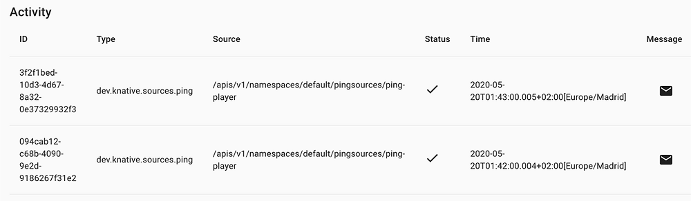
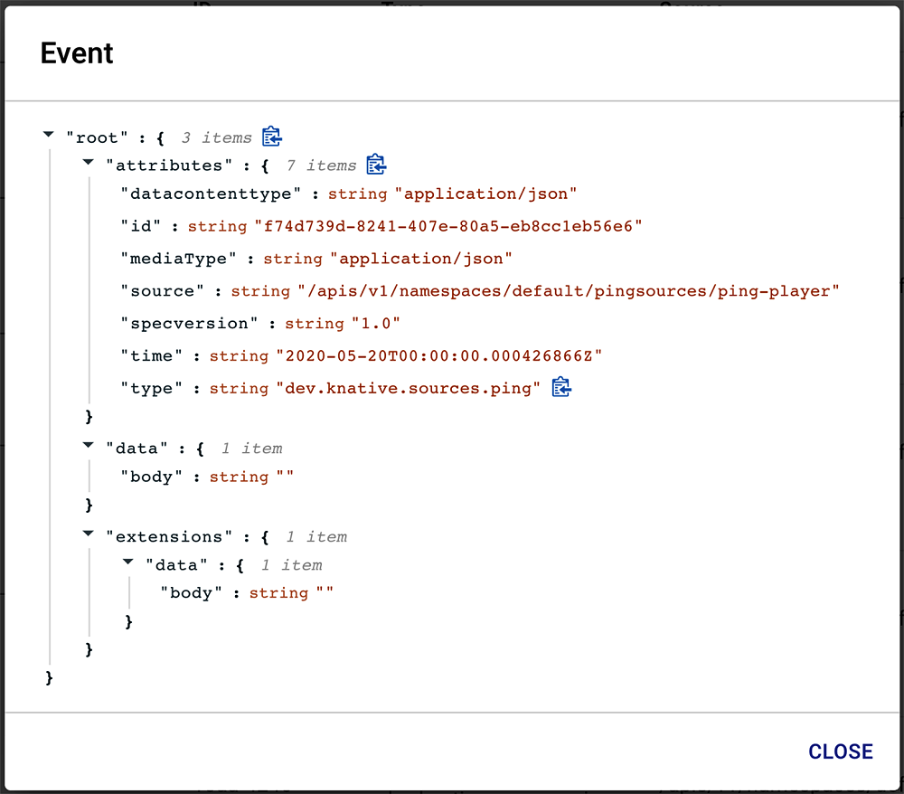
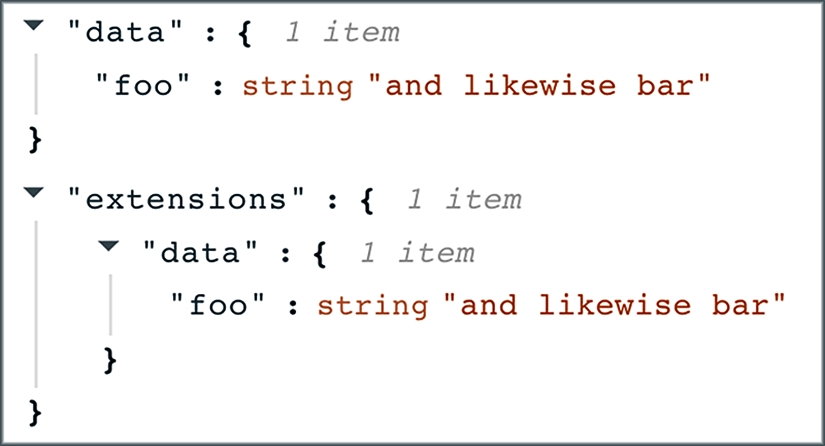

# 7 Sources and Sinks
## 7.1 Sources
###  7.1.2 Using kn to work with Sources
All good and well, but Sources are meant to be used, not dissected. Our trustworthy friend ``kn`` is standing by to help. Let’s first prove that I am not lying about the Sources that are installed by default. I present in my defense the following listing.

Listing 7.1 Using kn source list-types
```bash
$ kn source list-types
TYPE              S     NAME                                   DESCRIPTION
ApiServerSource   X     apiserversources.sources.knative.dev   Watch and send Kubernetes API events to addressable
ContainerSource   X     containersources.sources.knative.dev   Generate events by Container image and send to addressable
PingSource        X     pingsources.sources.knative.dev        Send periodically ping events to addressable
SinkBinding       X     sinkbindings.sources.knative.dev       Binding for connecting a PodSpecable to addressable
```
Here are the three amigos of ``ApiServerSource``, ``ContainerSource``, and ``PingSource``. As a reminder (or foreshadowing, if you’re reading the book out of order), these represent a Source for Kubernetes API events, an adapter for existing software in a Kubernetes Pod, and a Source for sending CloudEvents on a regular schedule. Plus there’s an interloper, ``SinkBinding``, which I’ll return to later.

You might have found ``list-types`` to be an odd subcommand name. My own first instinct is that ``list`` makes more sense. Is it aliased? Missing? Living in Panama under a false identity?

Listing 7.2 What does kn source list do?
```bash
$ kn source list
No sources found in default namespace.
```
Listing 7.2 reveals that none of my theories were correct (and I was so sure about the Panama thing). In fact, ``kn source list`` shows Source records that have been created and submitted, while ``kn source list-types`` shows what Source definitions have been installed. By a loose analogy to programming language concepts, list shows the objects, list-types shows the classes.

For working with ``ApiServerSource`` and ``PingSource``, kn provides some convenient subcommands. I’ll show off ``ping`` using the CloudEvents player that I installed in the previous chapter. The ``describe`` subcommand in the next listing follows conventions you should find familiar by now.

Listing 7.3 Creating and describing ``ping-player``
```bash
$ kn broker create default
Broker 'default' successfully created in namespace 'default'.

$ kn service create cloudevents-player \
    --image ruromero/cloudevents-player:latest \
    --env BROKER_URL=http://default

# ... log of service creation ...
 
Service 'cloudevents-player' created to latest revision  'cloudevents-player-skqwy-1' is available at URL:  http://cloudevents-player.default.example.com

#  kn source ping create ping-player --sink  http://cloudevents-player.default.192.168.59.200.sslip.io 
$ kn source ping create ping-player --sink http://cloudevents-player.default.example.com

Ping source 'ping-player' created in namespace 'default'.
 
$ kn source list
NAME          TYPE         RESOURCE                          SINK                                           READY
ping-player   PingSource   pingsources.sources.knative.dev   http://cloudevents-player.default.example.com  True
 
 
$ kn source ping describe ping-player
Name:         ping-player
Namespace:    default
Annotations:  sources.knative.dev/creator=jchester@example.com,
              ➥ sources.knative.dev/lastModifier=j ...
Age:          2s

Schedule:     * * * * *                                 ❶
 
Data:                                                   ❷
 
Sink:
  URI: http://cloudevents-player.default.example.com    ❸
 
Conditions:                                             ❹
  OK TYPE                AGE REASON
  ++ Ready                2s
  ++ Deployed             2s
  ++ SinkProvided         2s
  ++ ValidSchedule        2s
  ++ ResourcesCorrect     2s
```
❶ Generates a CloudEvent. It uses the charming Cron minilanguage, famous for being only slightly less murder-inducing than the Job Control Language of the mainframe era. The rule * * * * * is satisfied every minute.

❷ Data is the actual JSON sent onwards to the Sink. More in a second.

❸ As you would expect, this is the HTTP(S) URI to which PingSource is meant to send the Data.

❹ There are, as always, some Conditions.

If you open the CloudEvents player, you’ll see that ping events have begun to pile up (figure 7.4).

  
Figure 7.4 CloudEvents piling up each minute

This gives me a chance to reiterate that every CloudEvent must have a unique ID (in this case, UUIDs), a type, and a source. ``PingSource`` follows the common idiom of using reverse-domain notation for the type and path notation for the source.

The ``/api/v1`` prefix in the Source field is another Kubernetism poking through. ``namespaces/default`` tells you which namespace to look in for the actual ``PingSource`` record. The name that I provided to kn hangs off ``pingsources/ping-player``.

As an aside: these are idioms, not standards, nor requirements. Don’t rely on string-splitting on . or / to suss out the internals of type and source. You’ll just guarantee a future mystery.

It’s all well and good that CloudEvents are arriving, but what are these carrying? Right now, nothing. Click the Message icon (✉) to look more closely at what I mean (figure 7.5).

The ``root`` here is not part of CloudEvents: it’s how the CloudEvents player presents the CloudEvent JSON object. However ``attributes`` and ``data`` are definitely part of a CloudEvent, as are the attribute fields for **datacontenttype**, **id**, **source**, **specversion**, **time**, and **type**.

  
Figure 7.5 Looking more closely at a CloudEvent

The ``data`` section is worth some comment. It’s present, but its presence isn’t necessary to make this a conformant CloudEvent. ``PingSource`` includes one anyway. I don’t have strong feelings about whether that’s better or worse than an implicitly “undefined” value; it really comes down to the idioms of how your preferred programming languages and libraries expose JSON to you.

Before I get to ``extensions``, I am going to add some crunchy JSON to my pings using ``kn``. Then I’ll verify it was configured with both kn and the CloudEvents player as listing 7.4 shows.

Listing 7.4 Adding data and verifying using kn
```bash
$ kn source ping update ping-player --data '{"foo":"and likewise bar"}'
Ping source 'ping-player' updated in namespace 'default'.
 
$ kn source ping describe ping-player
Name:         ping-player
Namespace:    default
Annotations:  sources.knative.dev/creator=jchester@example.com,
              ➥ sources.knative.dev/lastModifier=j ...
 
Age:          2h
Schedule:     * * * * *
Data:         {"foo":"and likewise bar"}
 
# ... snip of Sink and Conditions
```

  
Figure 7.6 How it looks in CloudEvents player

You can see from both the ``kn source ping describe`` (listing 7.4) and the screenshot (figure 7.6) that my ``PingSource`` now includes ``{"foo": "and likewise bar"}`` in its CloudEvents ``data`` object. It is not put into a field called ``data.body``. It’s a direct child object of ``data``. The ``data.body`` key you saw earlier is used by ``PingSource`` as a placeholder only.

So what about ``extensions``? This is the serialized name for ``CloudEventOverrides``, which you’ll remember are part of any Source. These are more or less what they sound like. If you set an override, then Triggers will treat the overridden value as the actual value.

This is most useful for editing values to add context (for example, in a tracing framework). The presentation in figure 7.6 has a net effect of doing nothing. But if ``extensions.data.foo`` was ``no actually``, ``quux``, then a Trigger would treat that field as having that value.

Truthfully, I don’t think you should use ``extensions``. It’s the vestiges of a previous scheme for adding flexibility in design, which has been largely superseded by duck types. I will leave it off from here on in.
## 7.2 The Sink
In my examples so far I’ve positioned the ``Sink`` as being a URI. It turns out that this is only one way to express “send my CloudEvents here.” The other is to use a “Ref”—a reference to another Kubernetes record. Take the next listing, for example.

Listing 7.5 Updating my PingSource to use a Ref instead of a URI
```bash
$ kn source ping update ping-player --sink ksvc:cloudevents-player
Ping source 'ping-player' updated in namespace 'default'.
 
$ kn source ping describe ping-player
Name:         ping-player
Namespace:    default
Annotations:  sources.knative.dev/creator=jchester@example.com,  sources.knative.dev/lastModifier=j ...
Age:          1d
Schedule:     * * * * *
Data:         {"foo":"and likewise bar"}
Sink:
  Name:       cloudevents-player
  Namespace:  default
  Resource:   Service (serving.knative.dev/v1)
 
# Snip of Conditions
```

If you compare listing 7.5 to a previous ``describe``, you’ll see that the Sink readout has changed. The subfield used to be URI, but now you have ``Name``, ``Namespace``, and ``Resource``.

There’s no ``--sink-ref`` or ``--ref`` argument to signal to kn that you’re using a Ref instead of a URI. Your intention is derived from the syntax of what you pass in. If your argument starts with ``http://`` or ``https://``, the assumption is that you want a URI. If instead it starts with ``ksvc``:, the assumption is that you want a Ref.

What kn is showing you in the ``describe`` output is that it knows I’ve pointed it towards a Knative Service, because I asked for ``ksvc:cloudevents-player``. I could also have used ``service:cloudevents-player`` as a more explicit alternative. Whichever you pick, just remember that a Knative Service is not the same as a Kubernetes Service.

Which is better? URIs are simpler to start with and allow you to target endpoints that live outside the cluster Knative is running on. But consider using Refs instead. A URI is just an address, what lies on the other side is (for good or ill) a blackbox. But a Ref is a Knative construct referring to a Knative Service. Knative knows how to open the box to peek at what’s inside.

This is most useful when things go awry. Let’s demonstrate by creating some unexpected havoc as uncovered in this listing.

Listing 7.6 No more service
```bash
$ kn service delete cloudevents-player
Service 'cloudevents-player' successfully deleted in namespace 'default'.
 
$ kn source ping describe ping-player
 
# ... Snip so we can get to Conditions
 
Conditions:
  OK TYPE                AGE REASON
  !! Ready                5s NotFound    ❶
  ++ Deployed             1d
  !! SinkProvided         5s NotFound    ❷
  ++ ValidSchedule        1d
  ++ ResourcesCorrect     1d
```

❶ The Ready Condition is a top-level rollup of other Conditions.

❷ The more diagnostic Condition is that SinkProvided is !! (not OK). The NotFound reason explains why.

This information is surfaced because Knative Eventing can go and see if the nominated Ref actually exists. That’s not something it can do with URI. Think of Ref as being more like a phone number than an address. If I want to visit you, I can either just show up and hope you’re at home (URI), or I can ring ahead before making that trip (Ref). Where possible, you are better served with Ref.