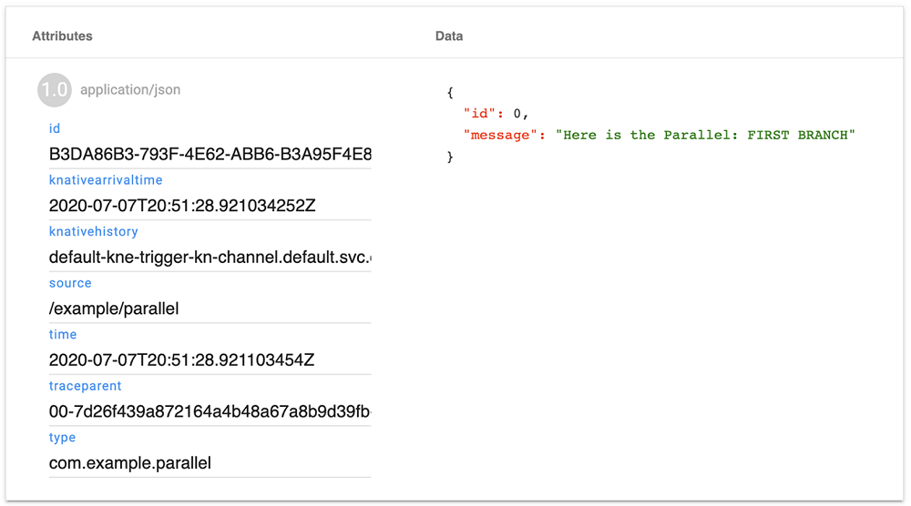

# 8 Filtering and Flowing
This chapter covers

* The Broker
* Triggers and filters
* Sequences
* Parallels

In the last chapter, I focused on the hard-wiring approach to Eventing. Now I want to look at some of the luxury features. These basically fall into two basic categories.

The first is brokering and filtering, creating a middleman to make the shipment of CloudEvents from one place to another simpler and more reliable. I’ve already spent a fair amount of time on the basics in previous chapters, but there are a bunch of additional capabilities around error-handling that I can at last reveal to you. I’ll also make a small detour into the lower-level guts of Eventing: Channels.

The second category of luxury features is flows, higher-level abstractions over the wiring of Sources, sinks, and so forth. These go last because these build on many of the topics we’ve discussed so far in chapter 7. I suspect that in time these will grow to be a larger and larger part of your systems.

Together, these luxury features can save you a fair amount of boilerplate. The goal is to express your intent at a higher level, after all, and to do so somewhat efficiently. Brokers, Triggers, Sequences, and Parallels provide higher abstractions that you can use to move CloudEvents to where these are needed with a minimum of hassle.

## 8.1 The Broker
But first, the Broker. Sources and Sinks are all very well, but have an essential difficulty: brittleness. If a Source or Sink disappear or isn’t available, your lovely event-driven architecture becomes uneventful rubble. As required by law and custom, Knative solves this problem by introducing indirection via the Broker.

> About the name

> “The Broker” is a slightly misleading title. For starters, Knative Eventing ships with an inbuilt broker, the “multi-tenant broker,” more often called the “MT Broker.” Why specify it as “multi-tenant”? As befits all confusing names, the answer is “History.” In the early days, there was just “the” Broker. You needed a copy running for every namespace where you used Eventing. The practical upshot is that Eventing could be fairly wasteful on large clusters with many apps running side-by-side, separated by Kubernetes namespaces.

> Then came the multi-tenant Broker, which was forked from the original Broker and modified so that it could deal with Eventing workloads spread across multiple Kubernetes namespaces. The overhead of running a Broker instance could then be amortized over many Triggers. Eventually, the original Broker code was removed and the MT Broker became “the” Broker.

> But it’s not “the” Broker either. It’s “a” Broker, the one that ships by default with Knative Eventing. But it’s permissible to write third-party brokers that follow a spec. These too are brokers, on a level footing with the inbuilt Broker. You might note that we first saw this pattern with Sources: there are a few built in, but nothing prevents you from using others, if that suits your purposes.

> Perhaps this sounds a little like a “Who’s The Architect-iest?” duel fought out in front of a whiteboard. But at least one third-party broker implementation exists: for GCP, optimized to run in that environment. I expect others will follow in time. For now, I use the MT Broker, because that’s what Knative installs for you. And for convenience, I will just refer to it as “the Broker.”

A Broker in Knative land serves two major purposes:

* It’s a sink, a place where CloudEvents can be reliably sent by Sources.1

* It gives life to Triggers. It applies their filters to incoming CloudEvents and forwards these to subscribers when filters match.

As a developer, you ideally don’t need to set up a Broker yourself. Knative will install one for you with some basic default settings, intended for development. Once installed, a Broker listens for Triggers that are submitted or modified.

How can you verify this? By creating a Trigger and then looking more closely. The next listing shows how.

Listing 8.1 Looking for the Broker
```bash
$ kn trigger create example-trigger \
    --filter type=dev.knative.example.com \
    --sink http://example.com/
 
Trigger  successfully created in namespace 
 
$ kn trigger describe example-trigger
 
Name:         example-trigger
Namespace:    default
Labels:       eventing.knative.dev/broker=default                ❶
Annotations:  eventing.knative.dev/creator=jchester@example.com,
              ➥ eventing.knative.dev/lastModifier ...
Age:          1m
Broker:       default                                            ❷
 
Filter:                                                          ❸
  type:       dev.knative.example.com
 
Sink:
  URI:  http://example.com/
 
Conditions:
  OK TYPE                  AGE REASON
  ++ Ready                 1m
  ++ BrokerReady           1m
  ++ DependencyReady       1m
  ++ SubscriberResolved    1m
  ++ SubscriptionReady     1m
```
❶ The eventing.knative.dev/ broker=default label that Eventing adds to help it identify which triggers belong to which brokers  
❷ The Broker: default field is a friendlier presentation of the same information.  
❸ The filter itself, where the Broker gets its instructions on picking and sorting CloudEvents  

## 8.2 Filters
Triggers include filters. When I created ``example-trigger`` earlier, I stapled a simple filter to it: ``type=dev.knative.example.com``. This says “let through any CloudEvent with ``type`` of ``dev.knative.example.com``.”

Eventing’s filtering rules are strict: exact matches only.2 There are no partial matches, no ``startsWith`` or ``endsWith``, no regular expressions. You can filter on multiple CloudEvent attributes, but this too is quite strict: all the fields must match. These are ANDed, not ORed.

Suppose I decided to do all my triggering based on the ``type`` and ``source`` attributes of CloudEvents. The following listing shows how I can set up a series of triggers and their filters with kn. Then figure 8.1 illustrates how these Eventing filters look.

Listing 8.2 Filtering all some of the things
```bash
$ kn trigger create trigger-1 \
    --filter type=com.example.type \
    --sink example-sink
Trigger  successfully created in namespace 
 
$ kn trigger create trigger-2 \
    --filter type=com.example.type \
    --filter source=/example/source/123 \
    --sink example-sink
Trigger  successfully created in namespace 
 
$ kn trigger create trigger-3 \
    --filter type=com.example.type \
    --filter source=/example/source/456 \
    --sink example-sink
Trigger  successfully created in namespace 
 
$ kn trigger create trigger-4 \
    --filter type=net.example.another \
    --sink example-sink
Trigger  successfully created in namespace 
 
$ kn trigger create trigger-5 \
    --filter type=net.example.another \
    --filter source=a-different-source \
    --sink example-sink
Trigger  successfully created in namespace 
```
Now, suppose I have a CloudEvent with ``type: com.example.type`` and ``source: /example/source/123``. What happens? The answer is that only exact matches will pass through the filter defined by a Trigger. Anything that doesn’t completely and entirely match gets ignored for that Trigger. And that’s what you can see in figure 8.1:

1. Matches because the CloudEvent’s ``type`` is ``com.example.type``.
1. Matches because the CloudEvent’s ``type`` is ``com.example.type`` and the ``source`` is ``/example/source/123``.
1. Fails because even though the CloudEvent’s type is ``com.example.type``, its ``source`` is not ``/example/source/456``.
1. Fails because the CloudEvent’s ``type`` is not ``net.example.another``.
1. Fails because the CloudEvent’s ``type`` is not ``net.example.another`` and/or its ``source`` is not ``a-different-source``.

This strictness is a mixed blessing. On the upside, it’s strict. In distributed systems, folks all too frequently allow today’s convenience be borrowed at high interest rates from tomorrow’s bugs and security holes. And, if you have highly specific filters, downstream systems are less likely to be accidentally overloaded by traffic with unexpected new fields or changes in demand.

The downside is that it’s inexpressive. If you like, you can try stringing multiple triggers together using De Morgan’s Law or Karnaugh maps and other things flung at inattentive Computer Science students, mostly in vain. And yes, you can combine filters using multiple ``AND``s to behave like ``OR``s, but I recommend against it. First, for mere sanity. The odds of creating infinite loops is quite high when all the pieces of one are widely spread out. Second, for performance. Knative Eventing very much treats Triggers as black boxes. It won’t sense that you intend to combine multiple filters into a single predicate in the way that, for example, a database query planner can. Each filter will be applied and then a message sent or not sent to a subscriber. Each such hop imposes delay and adds variability to the overall system you are working on.

You have three choices. One is to wait for Eventing to acquire a more expressive filtering system. Another is to perform some amount of filtering at the receiving end, meaning that some fraction of incoming CloudEvents is basically wasted. The third option is to inject additional information at the origin, against which simple filters can be applied.

You can filter on broadly “anything” in a CloudEvent. As I’ve already shown, you can add filters for ``source`` and ``type`` attributes. You can add filters for the other required attributes (``specversion`` and ``id``). You can also add filters for optional attributes (``datacontenttype``, ``dataschema``, ``subject``, and ``time``). And you can add these for extension attributes (like ``dataref``, ``partitionkey``, and so on).


  
Figure 8.1 Examples of filters for a CloudEvent

Note what’s missing from this list: filtering on the ***body*** of the CloudEvent. Only ***attributes*** are watched by a filter. For folks coming from previous generations of event-y systems, this won’t be a shock. Routing on metadata, headers, whatever you like to call those, is the norm. “Content-based routing” is less common.

You might be quite determined to do something like this anyway. For example, you might have a customer ID that you use to shard requests into different regions (European traffic goes to Europe, US traffic to the US, etc.). There’s no standard CloudEvent attribute for **customerID**. What do you do?

> **WARNING** When working with CloudEvent attributes, keep in mind that embedding any kind of personally identifiable information (PII) into attributes is risky. Earlier I used ``customerID`` as a possible field to transmit, possibly via ``subject``. That’s usually going to be OK. Much less likely to be OK is someone’s name, email address, phone number, national or public identification number, etc. You don’t know in advance where CloudEvents will wind up or what systems are traversed. That makes “right to forget” difficult to implement unless you use opaque identifiers instead of PII in your CloudEvents.

The first option is to DIY. Add some service, function, or gateway somewhere into the flow of CloudEvents and perform content-based filtering there. It is my suspicion that many readers will at this point fling the book over their shoulder in the rush to get to their keyboard, but please, reconsider. Do-it-yourself is also maintain-it-yourself-forever.

The second option, which is often the best option, is to find the most similarly defined attribute and use that. For example, it seems reasonable to use ``subject`` or ``partitionkey`` for distinguishing between customers. That is assuming, however, you’re not using those attributes already.

The third option is to add an attribute. This is a special case of DIY, for which my previous warning about book-flinging applies, but less strongly. Using a CloudEvent attribute instead of something embedded into the CloudEvent body has the advantage that future CloudEvent-aware systems will play more nicely with it, and code dedicated to attributes will probably see more optimization than the code that handles the body.

### 8.2.1 Filtering on custom attributes
A quick example is in order, but all I have time for is a fiddly example. The tools I’ve used so far (kn and the CloudEvents Player) don’t let me show what I’d like to show, so I will need to drop down to a lower level of abstracton. I’ll create CloudEvents manually and directly, POSTing these to the default broker.3

To do this, I must first create a forwarded port. I’ll use the magic spell in the following listing.

Listing 8.3 Forwarding a port
```bash
# In the first terminal
$ kubectl port-forward \
          service/broker-ingress 8888:80 \
          --namespace knative-eventing
 
Forwarding from 127.0.0.1:8888 -> 8080
Forwarding from [::1]:8888 -> 8080
```

Essentially, ``kubectl`` now maps my ``localhost`` port ``8888`` to port ``8080`` of the Broker’s ingress component.4 Slightly confusingly, I asked for port ``80`` and got ``8080`` instead. This has to do with how Kubernetes handles networking, and happily, it doesn’t matter to the discussion. But now you know.

Having now established a forwarded port in one terminal, I can directly send HTTP requests to the Broker from another terminal. The following listing shows this transmission.

Listing 8.4 Sending a CloudEvent with http
```bash
# In a second terminal
$ http post http://localhost:8888/default/default \      ❶
    Ce-Id:$(uuidgen) \                                   ❷
    Ce-Specversion:1.0 \                                 ❸
    Ce-Type:com.example.type \
    Ce-Source:/example/source \
 
    message="This is an example." \                      ❹
    --verbose
 
POST /default/default HTTP/1.1
Accept: application/json, */*;q=0.5
Accept-Encoding: gzip, deflate
Ce-Id: 4F4912F1-6F92-42A6-8FB5-35DA62D2520A
Ce-Source: /example/source
Ce-Specversion: 1.0
Ce-Type: com.example.type
Connection: keep-alive
Content-Length: 34
Content-Type: application/json
Host: localhost:8888
User-Agent: HTTPie/2.1.0
 
{
    "message": "This is an example."                     ❺
}
 
HTTP/1.1 202 Accepted                                    ❻
Content-Length: 0
Date: Wed, 24 Jun 2020 23:00:55 GMT
```
❶ Indicates the magic port-forwarded URL for the broker. First, localhost:8888 sends traffic to the kubectl port-forward we ran earlier, which then forwards it to the Broker ingress component running inside the cluster. The /default/default path tells that Broker ingress which Broker it’s dealing with: the default Broker, in the default namespace. (You needn’t memorize this, it won’t be on the final exam.)

❷ Every CloudEvent is meant to have a unique ID. For convenience, I use uuidgen to cook one up; you might need to install it on your OS.

❸ The Ce-Specversion, Ce-Type, and Ce-Source HTTP headers map to specversion, type, and source attributes, respectively. See the discussion on binary content mode in chapter 6 for more on how the headers are used.

❹ Here I use HTTPie’s key=value syntax for setting JSON keys.

❺ The key=value syntax is automatically transformed into {"key": "value"} for me by HTTPie.

❻ If sending a CloudEvent is successful, the broker responds with a 202 Accepted status. This indicates that it processed our CloudEvent. It’s not a 200 OK because, by default, the Broker won’t itself be generating any kind of response. It’s just accepting the CloudEvent on your behalf.

Most of this response is recognizably what we provided in our command. So far, not super interesting. For one thing, how will I know if things go wrong? And how will I know things go right?

> # Port forwarding woes
> One thing to note here is that the port-forwarding command isn’t meant to be a robust connection. If I close the terminal, or put my computer to sleep, or log out, etc., then the port-forwarding connection is dropped. When that happens, you’ll see hairy and unhelpful messages like this one:
> ```bash
> http: error: ConnectionError:
>   ➥ HTTPConnectionPool(host= port=8888):
>   ➥ Max retries exceeded with url: /default/default
>   ➥ (Caused by NewConnectionError(
>     ➥  object at 0x10f1411c0>:
>     ➥ Failed to establish a new connection:
>     ➥ [Errno 61] Connection refused
>   ➥ while doing a POST request to URL:
>   ➥ http://localhost:8888/default/default
>   ```
> It’s easily fixed. Run the port-forward command again (listing 8.3), and the connection is reopened.

The main mistake that the Broker can alert you to is malformed CloudEvents. Suppose I left out the Ce-Source header that would be mapped to the required source attribute as in this listing.

Listing 8.5 What happens when Ce-Source is missing?
```bash
$ http post http://localhost:8888/default/default \
    Ce-Id:$(uuidgen) \
    Ce-Specversion:1.0 \
    Ce-Type:com.example.type \
# Ce-Source is missing!
    message="This is an example."
 
HTTP/1.1 400 Bad Request
Content-Length: 28
Content-Type: text/plain; charset=utf-8
Date: Wed, 24 Jun 2020 23:15:00 GMT
 
{
    "error": "source: REQUIRED"
}
```

The ``400 Bad Request`` status means that I messed something up. Helpfully, the body of the response tells me what went wrong: ``"error": "source: REQUIRED"``. Note, however, that you don’t get an error key per mistake. Multiple errors are instead concatenated into a single string. For example, if I knock out both the ``source`` and ``type``, I get ``"error": "source: REQUIRED\ntype: MUST be a non-empty string"``. I’m not precisely sure why these error messages have inconsistent style, but I do know these are not well-suited to robust, automatic interpretation by monitoring systems. Watch for the ``400``s. You’ll need to dig a bit when these surface.

Now, how do I know things went right? Well, at a surface level, the ``202 Accepted`` status is sufficient. It tells you “Yes, I have the CloudEvent, and it was well-formed, and I am now going to do something with it.”

But that’s only one hop of the journey. I am, after all, trying to show you how to filter on an attribute of your own creation, which means finding some way to see CloudEvents emerging on the other side of the Broker. I hope that by now you expect that I will use a Trigger, pointed to the CloudEvents player. Almost. I will instead point to a different “show me stuff” system called Sockeye, which reveals a slightly lower-level view than the CloudEvents player does.5

Let’s install Sockeye and add a Trigger to send events there in the next listing.

Listing 8.6 Setting up and wiring Sockeye
```bash
$ kn service create sockeye --image docker.io/n3wscott/sockeye:v0.5.0
# ... usual output
 
$ kn service describe sockeye
Name:       sockeye
Namespace:  default
Age:        10s
URL:        http://sockeye.default.example.com     ❶
 
Revisions:
  100%  @latest (sockeye-rnjhs-1) [1] (10s)
        Image:  docker.io/n3wscott/sockeye:v0.5.0 (pinned to 64c22f)
Conditions:
  OK TYPE                   AGE REASON
  ++ Ready                   10s
  ++ ConfigurationsReady     10s
  ++ RoutesReady             10s
$ kn trigger create sockeye-source \
    --filter type=com.example.sockeye \          ❷
    --sink sockeye
Trigger  successfully created in namespace 
```
❶ The URL for Sockeye  
❷ Creates a filter, requiring source to equal com.example.sockeye

There, we’ve set up everything. Next, I navigate to the URL for Sockeye and take a look-see. As you can see in figure 8.2, it’s fairly spartan to begin with.


  
Figure 8.2 Nothing to see here

So, in the following listing, I’ll send Sockeye a CloudEvent (making sure to be one that matches my Trigger filter).

Listing 8.7 Sending a CloudEvent that will appear in Sockeye
```bash
$ http post http://localhost:8888/default/default \
    Ce-Id:$(uuidgen) \
    Ce-Specversion:1.0 \
    Ce-Type:com.example.sockeye \
    Ce-Source:cli-source \
    message="This is an example."
 
HTTP/1.1 202 Accepted
Content-Length: 0
Date: Thu, 25 Jun 2020 21:48:39 GMT
```

And now, when I look at Sockeye, I can see my message. It did indeed get filtered and forwarded based on the type attribute.

But I could already show that with the CloudEvents player. How can I filter on a custom attribute? Easy! Watch this:

Listing 8.8 Filtering on a custom attribute
```bash
$ kn trigger create sockeye-example-attr \
    --filter example=fooandbarandbaz \      ❶
    --sink sockeye
 
Trigger  successfully created in namespace 
 
$ http post http://localhost:8888/default/default \
    Ce-Id:$(uuidgen) \
    Ce-Specversion:1.0 \
    Ce-Type:com.example.type \
    Ce-Source:/example/somethingelse \
    Ce-Example:fooandbarandbaz \            ❷
    message="El zilcho"
 
HTTP/1.1 202 Accepted
Content-Length: 0
Date: Thu, 25 Jun 2020 21:54:37 GMT
```
❶ Sets the attribute to example with a value of fooandbarandbaz

❷ HTTP header for the attribute to be sent over Binary content mode, prefixed with Ce-

The key is that when creating a Trigger, I can use ``--filter`` for ***anything***. Having done that, I can prove that it worked by returning to Sockeye (figure 8.3).

### 8.2.2 Nice things that Eventing adds for you
Look again at figure 8.3 and you’ll notice that I was not the only one adding attributes to the CloudEvent. Knative Eventing also adds attributes to CloudEvents that it processes:

* ``traceparent``—A defined CloudEvents Extension attribute that I discussed in chapter 6. Adding it here ensures that downstream systems will have tracing information to hang their hat on.
* ``time`` and ``knativearrivaltime``—In the default Broker, ``knativearrivaltime`` is set when the CloudEvent first arrives at one of its two components: the Broker ingress. It’s “the moment that Eventing first saw the CloudEvent.” The ``time`` attribute is added in a lower layer: the CloudEvents SDK that Eventing relies on. It’s set when the CloudEvent is sent from the Broker to the Subscriber. And it’s only there as a stopgap. If I provide my own value for ``time``, it will be left alone.


  
Figure 8.3 Something to see here

You may be tempted to subtract ``knativearrivaltime`` from ``time`` to deduce some measure of processing time. Please don’t. For one thing, the processes involved might be running on different machines with clocks that disagree, meaning any such timing will be suspect. For another thing, Eventing records metrics for this exact purpose, as I’ll show in the next chapter.

## 8.3 Sequences
Given enough time, you can use Sources (and Sinks) to wire everything together. But that’s inconvenient, so you can use Brokers and Triggers to do it more simply. But at some point, that too becomes a hassle: remembering to provide the right collection of Triggers and being careful to set these up in the correct order. And further, Brokers can become a choke point in your architecture. The answer to this problem is to more directly move traffic from place to place without passing through the central hub. Sequences are the annointed way to fulfill this goal.

Why not just skip the Broker? Well, for one thing, it is a simple and flexible way to get started. Then, as time goes on, you will start to see “desire paths” in your architecture.

You may have seen desire paths in real life, possibly without knowing the name. A beautiful paved path cuts a straight, geometrically pleasing line across a lawn. But around it are the curving naked dirt tracks created by pedestrians walking where they want to walk, not where the landscape architects thought they ought to work. Wiser institutions wait for the desire path to emerge and then pave it.

I raise this analogy because distributed systems are not totally dissimilar. There is the path you thought demand would take through your systems, and there is the path that actually emerged in usage. Using the Broker and Triggers is a good way to find the desire path; once found, it can be swapped for a Sequence.

Another reason to use the Broker/Trigger approach first is that, as of this writing, ``kn`` doesn’t support Sequences (or Parallels). While I can use it for some of what follows, for the actual Sequences, I will use kubectl.

### 8.3.1 A walkthrough
I’m going to build a simple Sequence to demonstrate three main points: how CloudEvents get into a Sequence, how these move through a Sequence, and how these leave the Sequence. I’ll be building something like that shown in figure 8.4.


  
Figure 8.4 Our goal

I assume that you still have Sockeye running, but that you don’t have a ``PingSource`` right now. I’ll show why in a second. But first, let’s drop to some shiny, pretty YAML and look at the Sequence itself, which the following listing shows.

Listing 8.9 Your first Sequence
```bash
apiVersion: flows.knative.dev/v1beta1
kind: Sequence                                ❶
metadata:
  name: example-sequence                      ❷
 
spec:
  steps:                                      ❸
 
    - ref:                                    ❹
        apiVersion: serving.knative.dev/v1
        kind: Service
        name: first-sequence-service
    - ref:
        apiVersion: serving.knative.dev/v1
        kind: Service
        name: second-sequence-service
  reply:                                      ❺
    ref:
      kind: Service
      apiVersion: serving.knative.dev/v1
      name: sockeye
```   
❶ kind: Sequence tells Kubernetes what we’re talking about. It then delegates that to Knative Eventing for further work.

❷ Everything, even a Sequence, needs a name.

❸ The spec.steps block is the only compulsory part of a Sequence definition. It’s the truly sequential bit of Sequences, representing a list of destinations to which Eventing will send CloudEvents, using YAML’s array syntax. Order is meaningful: Eventing will read it from top to bottom.

❹ The ref here is not accidental. This is the same type of record used for sinks (a Ref). You can either put a URI here or manually fill out the identifying Kubernetes fields (apiVersion, kind, and name). The latter is one thing that kn does for you in other contexts.

❺ The spec.reply section is also a Ref, but only one Ref is allowed here. Unlike spec.steps, this is not an array. You can again choose between a URI or Ref.

What does this get us? Let’s ask, in our next listing.

Listing 8.10 Unreadiness revealed
```bash
$ kubectl get sequence example-sequence
NAME               READY   REASON                  URL                  AGE
example-sequence   False   SubscriptionsNotReady   http://example.com   8s
```
What I can see in listing 8.10 is that the Sequence is not ready, because ``SubscriptionsNotReady``. You might fairly and (spoiler!) accurately guess that the Subscriptions in this case are my two Services: ``first-sequence-service`` and ``second-sequence-service``. I have quite rudely defined a Sequence for things that don’t yet exist. I will create these now, using a simple example system provided by Knative Eventing for examples like this one (shown in the next listing).

Listing 8.11 Creating the sequential services
```bash
$ kn service create first-sequence-service \
 --image gcr.io/knative-releases/knative.dev/eventing-contrib/cmd/appender \
 --env MESSAGE= through FIRST
# ... usual output
 
$ kn service create second-sequence-service \
 --image gcr.io/knative-releases/knative.dev/eventing-contrib/cmd/appender \
 --env MESSAGE= through SECOND
# ... usual output
 
$ kubectl get sequence example-sequence
 
NAME               READY   REASON   URL                  AGE
example-sequence   True             http://example.com   8s
```
Figure 8.5 shows where we are so far. What’s left is to add ``PingSource`` as in the following listing.6


  
Figure 8.5 The Sequence so far

Listing 8.12 PingSource for Sequence
```bash
kn source ping create ping-sequence \
    --data  "Where have I been?"} \
    --sink http://example-sequence-kn-sequence-0-kn-channel.default.svc.cluster.local

Ping source  created in namespace 
```
Now, if I go to Sockeye, I can see the CloudEvents as those arrive after passing through the Sequence (figure 8.6).


 
Figure 8.6 How the CloudEvent looks after passing through the Sequence

Note the appending of ``Passed through FIRSTPassed through SECOND``, which I’ve left in its original buggy form to lend a righteous aura of truly production-grade software to the example. This is the evidence that Knative Eventing shipped the CloudEvent via the two steps defined in the Sequence.

One last point before I move on to a rigorous dissection of Sequences: you don’t need Sources to drive a Sequence. The Sequence satisfies the ``Addressable`` duck type in Knative Eventing. In short, anything that can squirt CloudEvents at the Sequence will work. Such as, for example, the Broker in the following listing.

Listing 8.13 Brokers and Sequences
```bash
$ kn source ping delete ping-sequence # a bit of tidying up
 
$ kn trigger create sequence-example \
    --filter type=com.example.type
    --sink http://example-sequence-kn-sequence-0-kn-channel.
      ➥ default.svc.cluster.local
Trigger  successfully created in namespace 
$ http post http://localhost:8888/default/default \
    Ce-Id:$(uuidgen) \
    Ce-Specversion:1.0 \
    Ce-Type:com.example.type \
    Ce-Source:/example/pewpew \
    message="PEW PEW!!! "
```

Figure 8.7 presents the evidence. We asked the Broker to filter on ``type: com.example .type`` and send it the URI for our Sequence. Then it popped out on the other side of our Sequence and into Sockeye. Figure 8.8 shows what happened diagrammatically.


  
Figure 8.7 Fishing out our directly created event

The point here is that you don’t need a Source to use Sequences. Anything that can send a CloudEvent over HTTP to a URI can be used to kick off Sequences.

   
Figure 8.8 The Broker can send CloudEvents to Sequences.

## 8.4 The anatomy of Sequences
And now to pick the bones. The Sequence has three main, top-level components. These include the steps and reply, which you’ve already seen, plus channelTemplate, which you haven’t.

### 8.4.1 Step
What I showed you in the walkthrough was that steps contain destinations. These are the same stuff as a Sink on a Source. You can either provide a URI, or you can provide some lower-level Kubernetes fields (the Ref) to identify what it is you’re addressing.

Suppose I have a Knative Service called example-svc-1, which answers to the URL https:/ /svc-1.example.com, plus another example-svc-2. Then I can define steps for each using either a URI or a Ref, as this listing shows.

Listing 8.14 URL take the low road and I’ll take the high road
```yaml
---
apiVersion: flows.knative.dev/v1beta1
kind: Sequence
metadata:
  name: example-with-uri-and-ref
spec:
  steps:
    - uri: https://svc-1.example.com
    - ref:
        apiVersion: serving.knative.dev/v1
        kind: Service
        name: example-svc-2
```
Note that I can mix and match the URI and Ref formats in the same Sequence. My general advice from previous encounters still holds: prefer the Ref to the URI for reasons of flexibility.

And now for a little foreshadowing: the URI or Ref are not the whole of a step. You can also attach error-handling configurations in a delivery section, a topic I’ll return to later in this chapter.

### 8.4.2 Reply
I have mixed feelings about the reply field.7 On the one hand, it’s something you should explicitly signal your intentions about. Either your Sequence is intended to swallow everything, or it’s intended to return an output of some kind to some destination. The presence or absence of reply can signal this intention fairly well.

But that’s part of my concern: it’s only a signal, only a hint. Nothing here is really enforceable, so it’s still going to rely on you and your peers being mindful about when it gets used. I expect linters will make this more visible in the future; for now, keep it in mind.

Should you even use reply? Yes and no. The case for “yes” is that you should consider it good practice to emit something from every Sequence. Even if all that gets emitted is a CloudEvent that says “yep, I’m done here.” It’s far easier to diagnose silent failures when failures cause silence. And if you have in fact adopted that rule, then there needs to be a final place to send that CloudEvent. A reply makes that intention explicit, and you can, for example, develop policies like “all Sequences reply to the same place,” or “all Sequences that handle Foometreonics without producing anything new must reply with a status to the Foometreonics metrics controller.”

Of course, there are many flows in which a reply is what you wanted in the first place. This comes about when you are creating Sequences programmatically, instead of manually laying out everything in advance. While a fixed architecture of Sequences can all reply to the same destination, a Sequence generated by process X should probably reply back to process X.

There is one small downside to the reply versus its step sibling. You can’t set any delivery configuration on it. Put another way: reply doesn’t provide fallback mechanisms in the way that steps can.

### 8.4.3 ChannelTemplate and Channels
I’ve largely avoided any in-depth discussion of Channels in the book, because I have wanted to focus your attention on higher-level, everyday concerns of developing, wiring, and updating functions or apps. There is a level at which the Channel is an irrelevancy. It’s just “a way” that your CloudEvents move from place to place.

A nice argument, as far as it goes. Details matter and, in the evil, backwards, upside-down, topsy-turvy, reversi-blinky, dunky-dorey-flibby-fizzy-bang-y world of distributed systems, details matter even more. In a single-machine system, you didn’t need to worry about function calls failing about 1% of the time or just not returning, or returning gibberish, or returning an incompatible type. By and large, things Just Worked, thanks to decades of investment in CPUs, RAM, operating systems, filesystems, compilers, linkers, and on and on. But add a network and a whole bunch of independent machines, and suddenly, it all goes to hell, or at least somewhere adjacent to hell (real estate agents will be here any second to rename it “Distributed Damnation Heights”).

So Channels matter. You will need to think about these at least once or twice when designing systems based on Knative Eventing. In particular, you’ll need to pay attention to the exact guarantees that your Channel implementation offers and decide whether these matter to your users (not you: your users).

So what does the ChannelTemplate actually look like? An awkward question for me to answer, because “it depends.” Eventing imposes little structure on a ChannelTemplate as the following listing shows.

Listing 8.15 The simplest channelTemplate I can remember
```yaml
apiVersion: flows.knative.dev/v1beta1
kind: Sequence
metadata:
  name: example-sequence-in-memory
spec:
  channelTemplate:
    apiVersion: messaging.knative.dev/v1beta1
    kind: InMemoryChannel
    spec:
        # ... anything goes!
  steps:
    # ... steps, etc
```

A ChannelTemplate, embodied here as a channelTemplate field on the Sequence, only requires that two subfields be set: apiVersion and kind. These are the ordinary Kubernetes fields of the same name. In the example YAML in listing 8.15, you can see that these sit directly under spec.channelTemplate.

But spec.channelTemplate.spec can be anything, so far as Eventing is concerned. The reason is that all Eventing does is to scoop out the ChannelTemplate and turn it into a Channel record. Which is what, I suppose, one would expect from a template. The apiVersion and kind fields tell it what kind of the record the template needs to be submitted as. The channelTemplate.spec is not validated by Eventing. Instead, spec validation is delegated to whatever Channel implementation is installed for that kind.

And so, in the example, the kind: InMemoryChannel means that Eventing delegates the Channel here to the in-memory Channel that I’ve used throughout this chapter. But it needn’t be so. For example, I might decide to use the Kafka Channel adapter as in this listing.

Listing 8.16 The metamorphosis into KafkaChannel
```yaml
apiVersion: flows.knative.dev/v1beta1
kind: Sequence
metadata:
  name: example-sequence-with-kafka
spec:
  channelTemplate:
    apiVersion: messaging.knative.dev/v1alpha1
    kind: KafkaChannel
    spec:
        numPartitions: 1
        replicationFactor: 1
  steps:
    # ... steps, etc.
```
Unlike InMemoryChannel, the KafkaChannel does need a spec. Here it carries configuration information about the connection to a Kafka broker, which you’d not see on an InMemoryChannel. And the same is true for other kinds of Channel implementations—their specs are going to be specialized for that particular Channel implementation. I’m sorry. You will need to read some docs.

The more cunning sort of developer is now wondering: If I edit my services to use a KafkaChannel, will I get a Kafka broker and so on? The answer is “no,” or at least, “no, unless your platform engineers installed it for you.” This goes back to my discussion in the previous chapter about provisioning versus binding.

Setting a channelTemplate field tells Eventing to perform the binding dance for you, but it won’t necessarily provision a Kafka broker. Someone needs to have (1) installed Kafka and (2) installed some kind of software that knows how to read and act on KafkaChannel records (much as Knative controllers know how to read and act on Service, Route, Source, Trigger, etc., etc.). The YAML in listing 8.16 will do neither; it’s purely a declaration of the binding you want to exist.

So the cunning developer is out of luck, but what about the lazy developer? Is the ChannelTemplate compulsory on my Sequences? Happily, the answer is “no.” If you choose not to provide a ChannelTemplate, one is provided on your behalf. Out of the box, Knative Eventing appoints InMemoryChannel for you, but platform engineers can override that default for either a namespace or for an entire cluster.

My expectation is that in general, as a developer, you won’t be setting channelTemplate often. Consider that you might want to use different Channel implementations and/or different Channel settings in different situations. It might be fine to use InMemoryChannel for a development environment, but less acceptable in production. If you manually set a channelTemplate, you’d need to either maintain two versions of the record or add some kind of ChannelTemplate ... template ... to your CI/CD infrastructure. Leaving out channelTemplate entirely rescues you from this fate.

### 8.4.4 Mixing Sequences and filters
You can mix and match Sequences with Broker/Trigger setups in basically any combination you please. This is again due to the magic of duck typing: a Broker can be a destination for a Sequence step or reply, and a Sequence can be a destination for a Trigger.

Your mix between these two should reflect the degree to which you have specialized your Sequences. Put another way: Put your stable, well-worn pathways into Sequences. Put Brokers and Triggers either in front of your Sequences (on the principle that filtering sooner is more efficient) or directly after your Sequences (on the principle that a Sequence need not care where its results wind up, but you do). In theory, you can have the Broker as a step inside a Sequence, but down this path lies confusion and madness; any bugs in your filter definitions will cause half-baked Sequence executions to pile up and place pressure on the overall system.

Effectively, I’m arguing that Brokers still wind up as a switchboard for your architecture, but that the switching is now between Sequences, not individual Services. As a particular Sequence®Broker®Sequence pathway becomes heavily used, you can consider whether to update it to become Sequence®Sequence, or even whether to combine the two Sequences into a single Sequence.

## 8.5 Parallels
Parallels resemble Sequences, but there are some ergonomic differences. Let’s look at the next listing.

Listing 8.17 Seems familiar
```yaml
---
apiVersion: flows.knative.dev/v1beta1
kind: Sequence
metadata:
  name: example-sequence
spec:
  steps:                                    ❶
    - uri: https://step.example.com
---
apiVersion: flows.knative.dev/v1beta1
kind: Parallel
metadata:
  name: example-parallel
spec:
  branches:                                 ❷
    - subscriber:                           ❸
        uri: https://subscriber.example.com
```
❶ In Sequence, each entry in the spec.steps array is a destination—a URI or Ref, as desired.

❷ In Parallel, the top-level array is spec.branches. It’s not an array of destinations. It’s an array of branches.

❸ Each branch has one required field: a subscriber, which is a destination. Again, you can use a URI or Ref here.

So why the extra level of indirection via subscriber, between spec.branches and uri or ref? It exists because a branch can actually carry quite a bit of optional configuration:

* ``filter``—A specialized destination that can pass or reject a CloudEvent. Much to my chargrin, it’s not the same as filters in a Trigger.

* ``reply``—It’s our old friend, Reply, but you can set one for each and every branch if you like.

* ``delivery``—I’m still holding this over until later, but it’s the same type as the one found in a step.

> # The two meanings of “filter”
>
> The filter in Parallel is not the same as a filter on a Trigger. It’s just a completely different, completely unrelated thing. It’s an unfortunate naming choice.
>
> Instead of being a rule that’s applied by a Broker or Broker-like system, a Branch’s filter is a destination. It’s a URI or Ref to which a CloudEvent is sent by Eventing and then whatever lives at that destination has to give a thumbs up or thumbs down.
>
> If you squint a bit, the combination of filter and subscriber is a lot like a two-step Sequence. The CloudEvent flows to the filter, then from the filter onto the subscriber.
> 
> But realistically, the filter and the subscriber are both fully-fledged processes; anything the filter can do, the subscriber can, and vice versa. In terms of expressing developer intention, it’s a nice separation and resembles guarded clauses. But the overhead of routing through a process to get a pass/fail decision can prove to be fairly hefty.
> 
> When should you use a filter on Parallel branches? My view is that you shouldn’t, with one exception. If your subscriber is an expensive or limited resource, you will want to shed as much unwanted demand before you reach it. For example, I might be running a system where I want to send some small fraction of CloudEvents to an in-memory analytics store for further analysis. Rather than inserting everything coming off the wire, I would prefer to shed load before reaching the database. In this scenario, the filter is a useful ally.

### 8.5.1 A walkthrough
The simplest thing you can do with a Parallel is to pretend it’s a Sequence. I’m going to demonstrate by recreating a single-step Sequence in the following listing. Note carefully that indentation is meaningful and also annoyingly finicky.

Listing 8.18 The contents of parallel-example.yaml
```yaml
---
apiVersion: flows.knative.dev/v1beta1
kind: Parallel
metadata:
  name: example-parallel
spec:
  branches:
  - subscriber:                     ❶
      ref:
        apiVersion: serving.knative.dev/v1
        kind: Service
        name: first-branch-service
    reply:                          ❷
      ref:
        kind: Service
        apiVersion: serving.knative.dev/v1
        name: sockeye+
```
❶ The subscriber is in the same branch definition as ...

❷ ... the reply.

I hate to belabor this point, but the indentation is important. The reply is not part of the subscriber—it’s a peer to it.

Now I can create a trio of Service (for subscriber), a Trigger (to manage the flow of CloudEvents into the Parallel), and the Parallel itself as does the following listing.

Listing 8.19 Setting up a Service and a Trigger

```bash
$ kn service create first-branch-service \
 --image gcr.io/knative-releases/knative.dev/eventing-contrib/cmd/appender \
 --env MESSAGE= BRANCH
 ... service creation output#
 
$ kn trigger create parallel-example \
  --filter type=com.example.parallel \
  --sink
  ➥ http://example-parallel-kn-parallel-0-kn-channel.
  ➥ default.svc.cluster.local
Trigger  successfully created in namespace 
 
$ kubectl apply -f parallel-example.yaml
  
parallel.flows.knative.dev/example-parallel created
```

Note that I used kn where I could, resorting to kubectl where I must. What do I expect to happen next?

Recapping: I have a Trigger to send matching CloudEvents to the Parallel’s URI. The Parallel sends that CloudEvent on to the Service I created, which appends FIRST BRANCH to whatever CloudEvent message passes it by. Then the CloudEvent should pop up in Sockeye.

Let’s poke things in the following listing. Then we can see what comes out in Sockeye (figure 8.9).

Listing 8.20 Poking the Parallel
```bash
http post http://localhost:8888/default/default \
  Ce-Id:$(uuidgen) \
  Ce-Specversion:1.0 \
  Ce-Type:com.example.parallel \
  Ce-Source:/example/parallel \
  message="Here is the Parallel: "
```
Figure 8.9 shows that I got a Sequence-like outcome. But doing what Sequence already does is not what Parallels were built for. I want to fan-out identical copies of the CloudEvent to multiple subscribers. It’s not hard, as this listing shows.


  
Figure 8.9 Receiving the CloudEvent in Sockeye

Listing 8.21 Sending to multiple branches
```yaml
---
apiVersion: flows.knative.dev/v1beta1
kind: Parallel
metadata:
  name: example-parallel
spec:
  branches:
  - subscriber:
      ref:
        apiVersion: serving.knative.dev/v1
        kind: Service
        name: first-branch-service
    reply:
      ref:
        kind: Service
        apiVersion: serving.knative.dev/v1
        name: sockeye
  - subscriber:
      ref:
        apiVersion: serving.knative.dev/v1
        kind: Service
        name: second-branch-service
    reply:
      ref:
        kind: Service
        apiVersion: serving.knative.dev/v1
        name: sockeye
```
In listing 8.22, I’ve decided to add a new second-branch-service as a subscriber. But both branches still reply to the sample place—Sockeye. Conceptually, it looks like that shown in figure 8.10


  
Figure 8.10 The conceptual model of Parallels

Listing 8.22 Updating my example
```bash
$ kn service create second-branch-service \
 --image gcr.io/knative-releases/knative.dev/eventing-contrib/cmd/appender \
 --env MESSAGE= BRANCH
 
# ... service creation output
$ kubectl apply -f parallel-example.yaml
parallel.flows.knative.dev/example-parallel configured
$ http post http://localhost:8888/default/default \
  Ce-Id:$(uuidgen) \
  Ce-Specversion:1.0 \
  Ce-Type:com.example.parallel \
  Ce-Source:/example/parallel \
  message="Here is the Parallel: "
```
Figure 8.11 shows the outcome: two copies. In this case, the Parallel made two copies of the CloudEvent and sent those to each of the branches (fan-out). Then those branches sent their reply to the same instance of Sockeye (fan-in).

You might be unconvinced that this is what actually happened. To prove it, I will create a second Sockeye service and have one of the branches reply to it. I’ll use some fancy kubectl trickery to avoid boring you with almost identical YAML (see the next listing).

Listing 8.23 Adding a second Sockeye and updating the Parallel
```bash
$ kn service create sockeye-the-second \
    --image docker.io/n3wscott/sockeye:v0.5.0
# ... service creation output
$ kubectl patch parallel example-parallel \
  --type= \
  -p= "path":"/spec/branches/1/reply/ref/name",
             ➥ "value":"sockeye-the-second"}]
parallel.flows.knative.dev/example-parallel patched
$ http post http://localhost:8888/default/default \
    Ce-Id:$(uuidgen) \
    Ce-Specversion:1.0 \
    Ce-Type:com.example.parallel \
    Ce-Source:/example/parallel \
    message="Here is the Parallel with parallel replies: "
```
  
Figure 8.11 Parallel CloudEvents in parallel

I’ve opened both sockeye and sockeye-the-second in two browser windows (figure 8.12), I can see that the Parallel did in fact send the CloudEvent to two different reply destinations.

  
Figure 8.12 Receiving the CloudEvent in two Sockeyes

I hope that you notice that these two CloudEvents (figure 8.12) are close to being identical.

But I should apologize, because my example here is not very well behaved. I now have two CloudEvents with identical id, source, and type fields; any conforming implementation is within its rights to treat these as the same logical CloudEvent, even though these are physically distinct. When working with Parallels, you need to take this into consideration when you have a fan-in. For example, if one branch does some kind of conversion to a different CloudEvent, you are largely in the clear. But if you are merely adding to a CloudEvent, as I did in listing 8.23, you need something stronger. Either you should be filtering so that logical duplicates don’t arise, or you should be changing one of id, type, or source according to what makes the most sense.

You might now be wondering whether you will need to laboriously provide a reply for every branch. The answer is “no,” for two reasons. First, you just might not care about the fate of a CloudEvent sent to a branch’s subscriber. You can leave reply out entirely; CloudEvents are delivered as HTTP requests, but no HTTP reply is expected or dealt with. Second, you can provide a single top-level reply for the whole Parallel. This acts as a default for every branch. You can override on any branch by providing a reply specific to that branch, but otherwise, anything coming out is sent on to the top-level reply. That means I can rewrite my YAML to be slightly shorter, as in this listing.

Listing 8.24 A simpler fan-in
```yaml
---
apiVersion: flows.knative.dev/v1beta1
kind: Parallel
metadata:
  name: example-parallel
spec:
  reply:
    ref:
      kind: Service
      apiVersion: serving.knative.dev/v1
      name: sockeye
  branches:
  - subscriber:
      ref:
        apiVersion: serving.knative.dev/v1
        kind: Service
        name: first-branch-service
  - subscriber:
      ref:
        apiVersion: serving.knative.dev/v1
        kind: Service
        name: second-branch-service
```
You may note that in listing 8.24, I have placed reply above branches. To be clear: it doesn’t make any difference to Knative Eventing. I’m doing that because it’s less likely to cause failures due to confusing indentation. If you put spec.reply below spec.branches in a YAML file, the visual difference between “this reply belongs to this branch” and “this reply belongs to this Parallel overall” is slight. It can be easily missed in an editor or during a code review.

As with Sequence, it’s possible to set the channelTemplate field on a Parallel at the top level. And like Sequence, it’s possible to place delivery settings, in this case, on each branch. Which means I must at long last reveal what the hell I’m talking about.

## 8.6 Dealing with failures
> A popular bumper sticker states that phenomena can and will spontaneously occur. (The bumper sticker uses a slightly shorter phrase.)
> 
> —Timothy Budd

Marcus Aurelius was a fairly calm and collected person, as far as Roman Emperors go, and he took the time to explain his reasons for remaining calm. But he only had to deal with powerful and warlike enemies, crushing economic difficulties, and a psychopathic son. He never had to deal with distributed systems. Or even the un-distributed kind, come to that. Had this been the case, his famous Reflections might have been Rants instead.

Yes, things fail. They fail so much. So often. It’s maddening. And it has been so for decades (some of my favorite laments are A Critique of the Remote Procedure Call Paradigm and A note on distributed computing). Eventing provides allowances for failure by implementing some common patterns: retries, retry backoffs, and dead-letter destinations.

What I’m going to describe now is the delivery type. It can be found in either a Sequence step or in a Parallel branch. The following listing demonstrates this.

Listing 8.25 Sequence steps and Parallel branches with delivery settings
```yaml
---
apiVersion: flows.knative.dev/v1beta1
kind: Sequence
metadata:
  name: example-sequence-delivery
spec:
  steps:
  - uri: http://foo.example.com
    delivery:
      # ... TBD!
---
apiVersion: flows.knative.dev/v1beta1
kind: Parallel
metadata:
  name: example-parallel-delivery
spec:
  branches:
  - subscriber:
      uri: http://bar.example.com
    delivery:
      # ... also TBD!
```
So what’s in a delivery field? Basically, it covers two things: retries plus backoffs, and dead letters. I’ll use a Sequence as my running example because it’s slightly less busy, but the discussion applies just as well to Parallels.

> NOTE All the delivery configurations I will discuss are optional. You can, in theory, have an empty delivery block. It will parse and pass validation, but it will look silly.

### 8.6.1 Retries and backoffs
Failure is inevitable and, in a distributed system, failure becomes close to normal. Retries are a simple coping tactic for failed operations. You typically don’t want to do it forever, so a first stop in retry logic is to cap the number of times an operation is retried as this listing indicates.

Listing 8.26 Delivery retries
```yaml
---
apiVersion: flows.knative.dev/v1beta1
kind: Sequence
metadata:
  name: example-sequence-delivery
spec:
  steps:
    - uri: http://foo.example.com
      delivery:
        retry: 10
```
A delivery.retry field is a simple integer. It’s defined as the minimum number of retries attempted, in addition to a first failed attempt to deliver a CloudEvent. In the YAML example in listing 8.26, I have retry: 10. If everything goes wrong, there will be at least 11 requests made, not 10.

It can be more than 11, because Channel implementations are allowed to deliver a CloudEvent more than once. This may come as a surprise. It’s common for various queue or message systems to have “at-least-once” guarantees. It’s much less common for these to provide “at-most-once” guarantees. “Once-and-only-once” guarantees, which is the intersection of the two, is arguably impossible, depending on how one defines the problem. This is partly why CloudEvents encourage you to provide unique id, source, and type fields—to help downstream systems to sanely ignore re-deliveries. Especially since retry might be causing deliveries which are successful, but where the delivery result is incorrectly considered to be failed. In that scenario, retries cause the same CloudEvent to be sent multiple times.

Speaking of problems with retries, you probably don’t want to try again instantly. Done poorly, these lead to “retry storms,” where hapless upstream systems get mashed into paste by rampaging mobs of impatient downstream systems. Systems that are buckling under load are notoriously bad at having spare non-buckled capacity to communicate their general state of buckled-ness. When a system is merely teetering on the edge of overload, overly aggressive retries will just push it over.

Hence the need for backoffs, configured with backoffDelay and backoffPolicy. The backoffDelay is a duration expressed in a simple format (e.g., “10s” for 10 seconds). The backoffPolicy describes how that duration will be used.

If I set backoffPolicy: linear, retries are made after fixed delays. If I have backoffDelay: 10s, retries are attempted at 10 seconds, 20 seconds, 30 seconds, and so on.8

If I set backoffPolicy: exponential, retries take twice as long between each attempt. With the same backoffDelay: 10s, attempts are made at 10 seconds, 20 seconds, 40 seconds, and so on. The backoffDelay provides a base value that is raised by a power of 2 on each attempt—1x, 2x, 4x, 8x, ..., etc.

### 8.6.2 Dead letters
All the retries may be for naught, however. One option might be to just give up entirely and let the CloudEvent evaporate into thin air. For some use cases that is perfectly fine. Losing a metric point now and then is OK, if your use case is to summarize single points into statistics, because the presence or absence of one data point won’t affect results enough to be worth worrying about. But if you’re losing a lot of CloudEvents, or if you’re using CloudEvents to encode information where the individual event has a high independent value (“the server has crashed with a stack overflow,” “the customer added a hat to their shopping cart”), then accepting silent lossiness is not ideal.

More likely than either of those, to be honest, is just plain old bugs. You made changes that work in testing but somehow glitch in production. Two versions of the software are running during deploy, and versions from v1 ® v2 are working fine, but from v2 ® v1 (which you don’t test because oops) are silently failing. You spin up an ancient log and replay it to recover an old record, but the schema changed and there’s a weird bug in version 22.7 of the DangNabbit.io proxy, and you forgot to sacrifice the right goat, and now every 121st message vanishes, but you don’t notice it because your software rolls up in multiples of 120 ... you get the idea.

The deadLetterSink is an additional guardrail against unforeseen problems like these. You nominate a place where, if all regular delivery attempts fail, a CloudEvent will wind up. And then, I hope, you have monitoring turned on to annoy you the first time that ever happens, because dead letters are a Big Bad Red Flag that you need to investigate. And you should also, periodically, inject a known bad CloudEvent to see if it does, in fact, wind up in the dead letter sink.

The dead letter pattern isn’t perfect. The sink can be down, or it can be the victim of sudden hammering when some high-demand service vanishes and it begins to receive everything. But it’s invaluable as a safety net. When it’s there and when it’s working, you get the real CloudEvent that failed to get somewhere, which gives you more clues as to why.

### 8.6.3 The bad news
There’s a small fly in the delivery ointment: it’s meant to be interpreted and acted on by Channel implementations, but it’s optional for these to do so. As of this writing, only the InMemoryChannel actually does so. Not my favorite state of affairs, but I expect it will change rapidly as Eventing becomes more widely used and supported.

# Summary
* Brokers are responsible for two things: acting as a sink for CloudEvents and for acting on Triggers.
* Channels are responsible for transporting CloudEvents between Knative Eventing components such as Sources, Brokers, and Sequence steps or Parallel branches.
* Triggers have filters that are exact matches on particular attributes.
* Sequences can wire multiple linear steps without needing to route everything through the Broker.
* Sequences have steps, replies, and ChannelTemplates.
* You can use Triggers to enter a Sequence.
* Parallels can fan-out and fan-in a CloudEvent to multiple services without needing to route through the Broker.
* Parallels have branches, channelTemplates, and replies.
* Branches have filters. These are not the same as Trigger filters.
* Branches can have a subscriber and a reply.
* Failure policies can be described on Parallel branches and Sequence steps using delivery.
* Delivery can have retries, backoff delays, backoff policies, and a dead letter sink.
* Delivery does not, however, have to be implemented by a channel. Only the InMemoryChannel implements delivery configuration at time of writing.

# References
* Matt Moore, Grant Rodgers, et al., “Knative Broker Specification,” http://mng .bz/yYoq
* Andrew S. Tanenhaum and Robbert van Renesse, “A Critique of the Remote Procedure Call Paradigm” (Department of Mathematics and Computer Science, Vrije University, 1987)
* Jim Waldo, Geoff Wyant, et al., “A note on distributed computing” in International Workshop on Mobile Object Systems (Springer, Berlin, 1996). Originally published as SMLI TR-94-29, “A Note on Distributed Computing” (Sun Microsystems Labs, Inc. Tech Reports, 1994). Available online: http://mng.bz/MX1n

