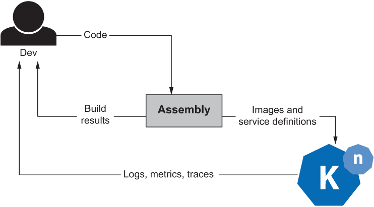
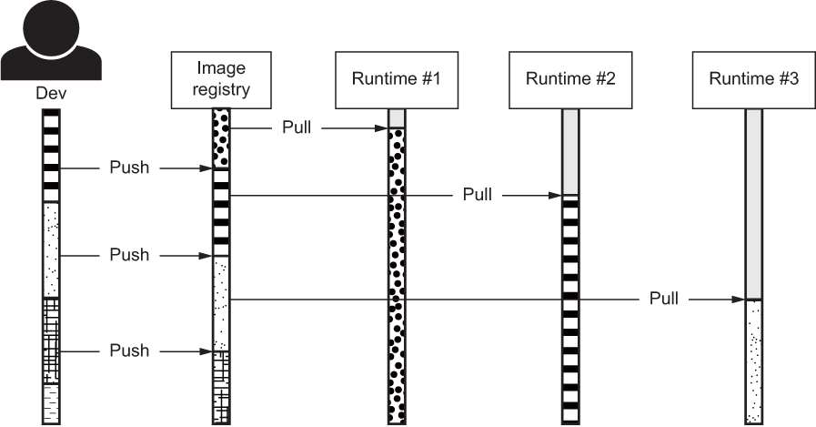
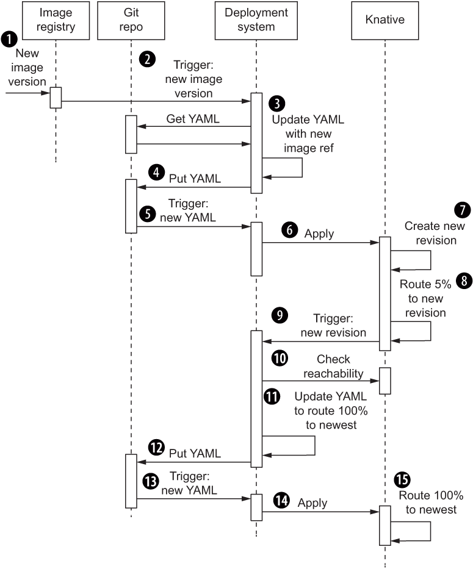
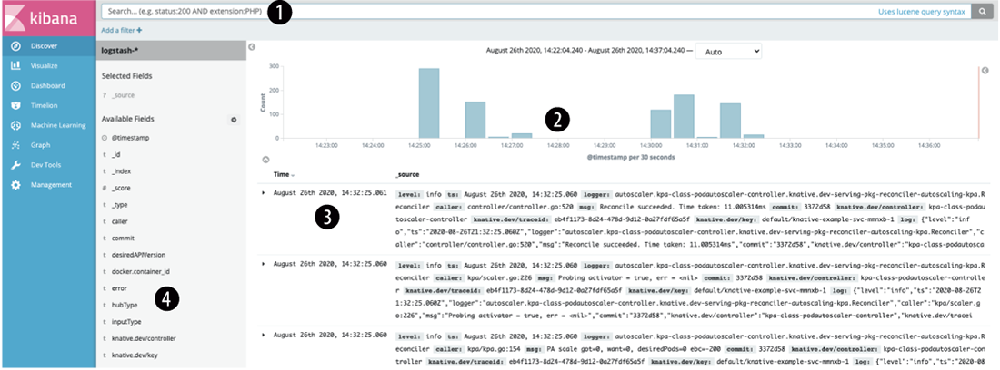
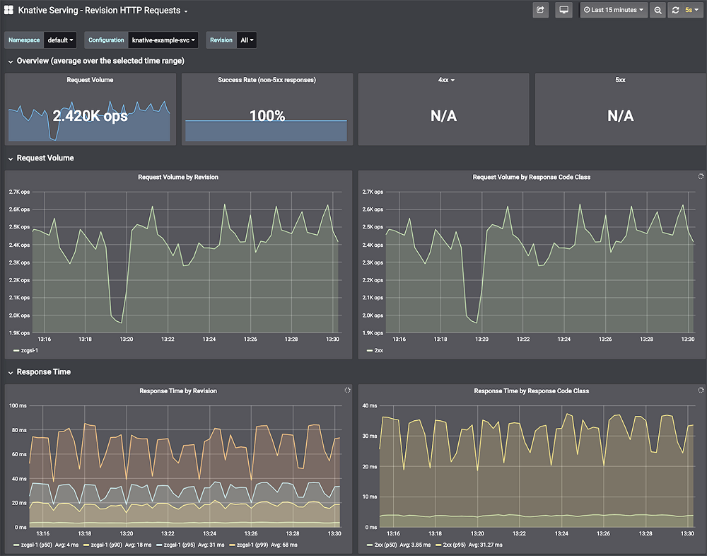
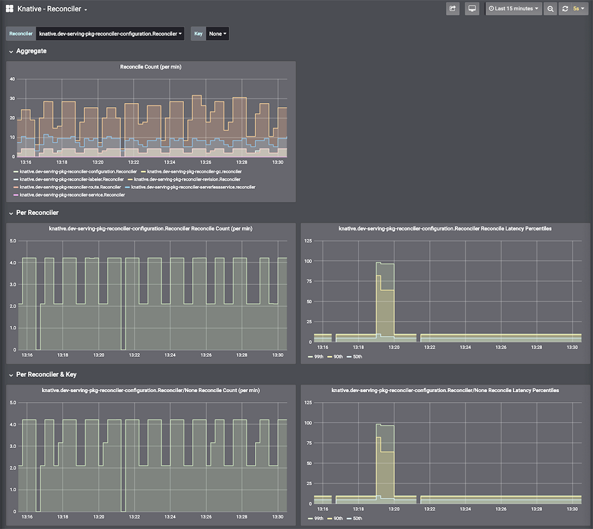
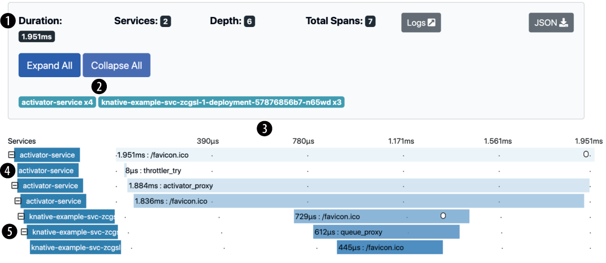
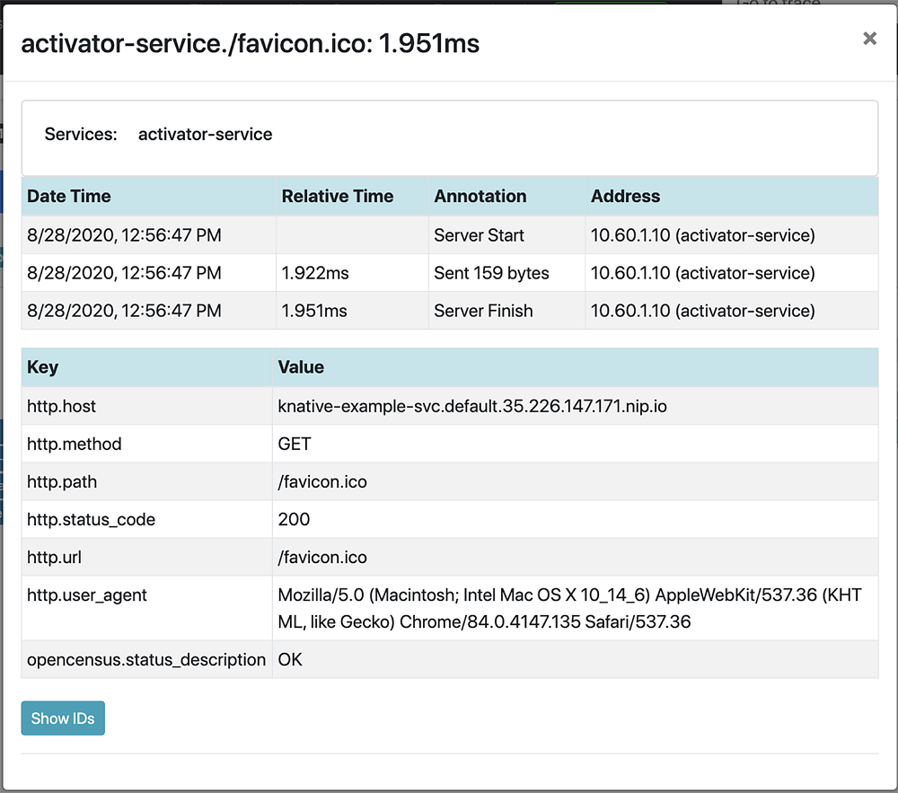

# Knative Example Concourse Pipeline

This repo contains an example of using [Concourse](https://concourse-ci.org/) and [`ytt`](https://get-ytt.io/) to roll out a Knative Service, triggered by a new image.

The example was developed for Chapter 9 of [Knative in Action](https://www.manning.com/books/knative-in-action).

I don't support this repo at all. Feel free to study it, but I'm unlikely to answer questions or respond to PRs quickly.

## Setting the pipeline

```bash
fly --target name_of_your_concourse_target \
	set-pipeline \
	--pipeline knative-example-dev \
	--config concourse/pipeline.yml \
	--var cluster_api=$(kubectl config view --minify -o jsonpath='{.clusters[].cluster.server}') \
	--var cluster_ca=$(kubectl config view --flatten --minify -o jsonpath='{.clusters[].cluster.certificate-authority-data}') \
	--var cluster_token=$(kubectl config view --minify -o jsonpath='{.users[].user.auth-provider.config.access-token}') \
	--var git_repository_uri='git@ ... URI for your git repo' \
	--var git_private_key=$(cat /path/to/your/private/key) \
	--var git_name='The name you use for git commits' \
	--var git_email='The email address you use for git commits'
```

## Not suitable for production use

Like the header says, and the book says, this is a simple example, not a robust solution.

In particular, this example repo has _both_ the pipeline configuration _and_ the history of rendered templates. In a real setup, the rendered templates would be written to and read from a dedicated 'robots' or 'history' repository.

# Chapter 9 From Conception to Production
This chapter covers

* Building containers with Cloud Native Buildpacks
* Progressive rollout using general CI/CD tools
* Logging, metrics, and traces

What I’ve spoken about so far is Knative-as-Knative. But software doesn’t exist in a vacuum—it has to be made and run. To wrap up the book, I’d like to touch lightly on the basics of what comes next in the real, day-to-day work we have to do. Pivotal Tracker calls these “Chores”: things you need to do to make things tidier around the place, so that you can move faster in the future.

We tend to neglect these as a profession. In the kitchens of Michelin-starred restaurants, perfectionist chefs are taught to obsess over *mise en place*—“Everything in its place.” Before cooking a dish, they want every knife, every herb, every surface, every ingredient, every utensil, every pan, every gas burner, everything, to be clean and sharp and fresh and in the same place as it always is.

Right now you have your software, on to which I imagine you have lavished all the attention and love that you can muster. And you’ve now learned about Knative, which is a system that can launch, run, scale, and wire together your software.

Now it’s time to talk a little bit about the connective tissue. The first is getting your software into Knative. The second is observing its behavior. I’ve talked about how you are the controller that sits above Knative and your software (figure 9.1). Well, here’s the part where I describe two arrows: getting your software into production (actuation) and seeing how it behaves in production (sensing).


  
Figure 9.1 You are in the loop too.

## 9.1 Turning your software into something runnable
Let’s first look at the business of converting source code into a container image. A common practice is to use a Dockerfile and hang everything off the *latest* tag. I am not a fan. My views are that you can’t trust registry tagging, and you should at least consider alternatives to Dockerfiles.

What alternatives? There are many. But before I arbitrarily pick the one that by pure coincidence I have previously worked on, I will take a moment to insist that you always use digests.

### 9.1.1 Always use digests
This is important and will take some time to explain. Stay with me.

Deep down, a container image is a bag of tarballs, sticky-taped together with some JSON. When you hand over a Service to Knative to run, it delegates down to Kubernetes to run. Kubernetes, in turn, delegates down to its “kubelet” agents to run. The kubelet agents will, in turn, turn to an actual container runtime, such as containerd, to actually truly run the software.

The most important input given by the container runtime is a reference to the container image that it should run. As I’ve noted before, a single image can be referred to in many ways. But ultimately, the runtime needs to convert the reference into a URL, fetch metadata about the image, then fetch the blobs that contain the image’s actual contents.

So far so good, but fetching blobs isn’t free. So container runtimes will typically maintain a local cache of images and layers. If a runtime has fetched example/foo before, it won’t bother dialing out when asked again to run a container using the example/foo image. It picks up what it has on disk and uses that.

Here is the problem: example/foo is a name that doesn’t have an exact, stable meaning. From moment to moment, it can refer to different images, depending on which system you ask. Each container runtime in your cluster can completely disagree about which image is example/foo:latest. And these can all disagree with the registry that you just pushed to.

But there’s more! Different names can refer to the same image (as in identical, byte-for-byte), but still be considered to be different by container runtimes. So when the container runtime checks to see if it has example/foo in its cache, there is no guarantee whatsoever that the example/foo in its local cache is the same as the one in the registry it is configured to fetch things from. In fact, you have no guarantees about what it means whatsoever. All you’ve had to enforce consistency, up until now, is lucky timing.

Kubernetes tried to make this less painful by introducing the ``imagePullPolicy`` configuration item, which Knative allows you to set. In particular, it lets you set this to ``Never`` (uninteresting for our purposes), to ``IfNotPresent``, or to ``Always``. At face value, these should be enough. But they are not.

Setting ``IfNotPresent`` collides with the problem of names being mutable. It ensures that, over time, a cluster will wind up with multiple versions of an image in circulation, because different Nodes will fetch from the registry at different points in time.

  
Figure 9.2 Without digests, this nightmare will eventually be yours.

So how about ``Always``? It still doesn’t solve the inconsistency problem, because it’s only applied when containers are being launched from the image. If a copy of your software runs for a long time on node #1, then later a second copy is launched on node #2, you can still wind up with inconsistent versions. And, of course, ``Always`` means you enjoy no gains from caching.

Figure 9.2 lays out a scenario where, at the end, there are **five different versions** of an image in circulation. It’s easy for the developer’s mental model to be far out of sync with the actual state of the cluster. This scenario can occur whether you use ``Always`` or ``IfNotPresent`` policies, depending on the exact order of events.

The ``only`` way out of this mess is to use fully-qualified (also called “digested”) image references, which means image references that include a digest (e.g., *@sha256:abcdef123*...). Unlike any other form of reference, an image reference with digest refers to one, and only one, container image. That reference is immutable and exact. What it refers to today, it will refer to tomorrow, next week, next year. That’s because it’s based on the image itself, the actual and exact bytes. It doesn’t rely on a registry definition. It can be computed from the image. Change one bit and the digest becomes radically different.

> NOTE “What about tags?” you ask. “What’s wrong with example/foo:v1.2.3 if my CI system is generating trustworthy image tags?” The problem is that tags are mutable. There’s no guarantee that v1.2.3 will be the same image tomorrow. In fact, tags can be ``deleted``. Basically, relying on tags is begging for bitrot.

For folks using raw Kubernetes, fully-qualified image references plus ``IfNotPresent`` are both safe and efficient. But that requires you to exercise discipline in how you use Kubernetes resources like Pods or Deployments. Kubernetes itself enforces no policy about the image references you provide; it basically pipes those directly to the container runtime and leaves any dire consequences to rest upon your immortal soul.

Knative takes an important step towards sanity on your behalf: If you submit a fully-qualified image reference, it will use it. If you don’t, Knative will **create one for you**. That is, it will resolve a loose reference like **example/foo** into a fully-qualified one like **docker.io/example/foo@sha256:2ad3**... whenever a Revision is created.

This is critical to ensure that Revisions are consistent and stable. It ensures that every running copy of a Revision uses an identical container image. And it ensures that if you use that Revision again in the future, you will still get the same container image.

However, I think you can and should go further. Anywhere that you create an image, or define a record with an image reference, **you** should **always** use the fully-qualified version. That’s because the gap between “an image was created” and “the image is used” can be quite wide. Knative can’t see backward into your CI/CD pipeline. When it resolves an image reference, it can only see what is in a registry at that instant. That might or might not be what you think it is. But if you use the fully-qualified reference, you are guaranteed to get the exact image you expect.

### 9.1.2 Using Cloud Native Buildpacks (CNBs) and the pack tool
Maybe you have built a container image before, and maybe you haven’t. If you have, you probably used a Dockerfile. My views on Dockerfiles are unflattering. I recognize that these are easy to start with and almost universal in their usage. But these are also arguments for Bash, that plucky platoon of hacks masquerading as a programming language. Dockerfiles are like the first stage of a Saturn V rocket. They got things off the ground, but they aren’t the destination. I want to stretch you a little.

There are numerous alternatives in circulation. My favorite is Cloud Native Buildpacks. I opened this book with the Onsi Haiku Test:

```
Here is my source code.
Run it on the cloud for me.
I do not care how.
```

To me, buildpacks were always the bedrock of this promise, because these meet you at the **code**. Deployment artifacts come and go, but there will always be code. Learning to write a Dockerfile requires a short tutorial to begin with, and then a fair few longer tutorials to create safe, efficient, secure images.

But to use buildpacks, historically, you just typed ``git push heroku`` or ``cf push`` and that was ``it``. In fact, that is ``still`` it. All the clever optimizations and security mechanisms are done for you.

So I like buildpacks. And the easiest way to use Cloud Native Buildpacks (CNBs) is the ``pack`` CLI.

Listing 9.1 helloworld.go
```go
package main
 
import (
    "fmt"
    "net/http"
)
 
const page = `
<!DOCTYPE html>
<html>
<head>
    <title>Hello, Knative!</title>
</head>
<body>
    <h1>Hello, Knative!</h1>
    <p>See? We made it!</p>
</body>
</html>
`
 
func main() {
    fmt.Println("OK, here goes...")
    http.HandleFunc("/", func(w http.ResponseWriter, r *http.Request) {
        fmt.Fprintf(w, page)
    })
    http.ListenAndServe(":8080", nil)
}
```

Suppose I have a simple, single-file Go program, like the one in listing 9.1. All it does is write a fixed chunk of HTML into the response of any HTTP request. And I must begrudgingly accept that Go makes it easy to write quick-n-dirty programs like this one. No frameworks and no needing to select an HTTP library. Just import from the standard library and you’re off to the races.

Each buildpack can understand how a given language ecosystem looks. In the case of Go, a buildpack can rely on the convention that the ``main()`` function in the main package will be what needs to be run at launch. And then it does the rest for you in terms of turning that into an efficient, reproducible container. Listing 9.2 shows how a ``pack build`` looks.

Listing 9.2 Tightly packed
```bash
$ pack build eg --path ./
 
tiny: Pulling from paketo-buildpacks/builder           ❶
f83c9afda5ef: Already exists
b839abbd6cba: Already exists
96914eecdef7: Already exists
14b23dd2b80a: Already exists
4e4e7b1ce15e: Pull complete
849c3a63fdbf: Pull complete
4c2d02b49fab: Pull complete
001fccc4ad38: Pull complete
ea92060a149b: Pull complete
1d8713b8430e: Pull complete
0c33a3ac2707: Pull complete
7c29e2eef350: Pull complete
5e64e68d5e00: Pull complete
7bec636aa549: Pull complete
f3452e1989b0: Pull complete
3e71995b619f: Pull complete
07cdcccb0c6c: Pull complete
7fc970a75c69: Pull complete
89732bc75041: Pull complete
Digest: sha256:da8da3bcce3919534ef46ac75704a9dc
  ➥618a05bfc624874558f719706ab7abb1
Status: Downloaded newer image for gcr.io/paketo-buildpacks/builder:tiny
tiny-cnb: Pulling from paketobuildpacks/run
Digest: sha256:53262af8c65ac823aecc0200894d37f0
  ➥c3d84df07168fdb8389f6aefbc33a6d7
Status: Image is up to date for paketobuildpacks/run:tiny-cnb
 
===> DETECTING                                    ❷
paketo-buildpacks/go-dist  0.0.193
paketo-buildpacks/go-build 0.0.15
 
===> ANALYZING                                    ❸
Previous image with name "index.docker.io/library/eg:latest" not found
Restoring metadata for "paketo-buildpacks/go-dist:go" from cache
Restoring metadata for "paketo-buildpacks/go-build:gocache" from cache
 
===> RESTORING                                    ❹
Restoring data for "paketo-buildpacks/go-dist:go" from cache
Restoring data for "paketo-buildpacks/go-build:gocache" from cache
 
===> BUILDING                                     ❺
Go Distribution Buildpack 0.0.193
  Resolving Go version
    Candidate version sources (in priority order):
      <unknown> -> ""
 
    Selected Go version (using <unknown>): 1.14.6
 
  Reusing cached layer /layers/paketo-buildpacks_go-dist/go
 
Go Build Buildpack 0.0.15
  Executing build process
    Running 'go build -o
      ➥ /layers/paketo-buildpacks_go-build/targets/bin -buildmode pie .'
      Completed in 1.18s
 
  Assigning launch processes
    web: /layers/paketo-buildpacks_go-build/targets/bin/workspace
 
===> EXPORTING                                     ❻
Adding layer 'launcher'
Adding layer 'paketo-buildpacks/go-build:targets'
Adding 1/1 app layer(s)
Adding layer 'config'
*** Images (9d6e49ea8c1b):
      index.docker.io/library/eg:latest
Reusing cache layer 'paketo-buildpacks/go-dist:go'
Adding cache layer 'paketo-buildpacks/go-build:gocache'
Successfully built image eg
```
❶ Here pack uses Docker to run a builder image that contains buildpacks and all the machinery needed to run those. Docker then fetches paketo-buildpacks/builder to use for the rest of its work. Docker’s output is piped through pack.

❷ The first step in running buildpacks is detection to identify which buildpack to run. Each buildpack looks at the source code and says whether it can do something with it. In this case, the paketo-buildpacks/go-dist and paketo-buildpacks/go-build buildpacks have raised their hands.

❸ Checks to see if there are any previous build outputs that can be reused. I’ve used pack on this machine before, so common layers created by /go-dist and /go-build are already present.

❹ If the analyze step identifies that there are previously built layers that don’t need to be rebuilt, the restore step picks these up for use in the rest of the build.

❺ The build step is closest to what you’d do yourself, either by hand or in a Dockerfile. It picks a language or compiler version, runs a build command, and calculates what command is needed to run the executable it creates. This output varies according to language ecosystem. If you provide a Java project with Maven, for example, there’s often quite a lot of output around fetching dependencies and running the build. It also needs to create a fairly detailed command to effectively configure the JVM for efficient use of a container environment.

❻ Once building is complete, the export step gathers together all the layers that were restored, along with any new or updated layers that were built, and assembles those into the final container image.

By default, ``pack`` gives you a fairly chatty account of its activities. When run using a Docker daemon, it also passes through any output given by Docker.1 Its chattiness lets me point out a few landmarks in listing 9.2.

The result of the command I gave in listing 9.2 is a container image I can run with a local Docker daemon using ``docker run -p 8080:8080`` eg. That’s because at the end of the process, the image has been added to Docker’s local cache of images. But that’s no good for Knative, which lives somewhere else and relies on registries to store and serve up container images.

That’s solvable, though, using the ``--publish`` option. As the name suggests, it causes ``pack`` to publish a built container image to a registry. Having done that, it becomes possible to use ``kn`` to run it as the following listing proves.

Listing 9.3 Build it, run it, see it
```bash
$ docker login --username <your username>
Password: <your password>
Login Succeeded
 
$ pack build <your username>/knative-example --path ./ --publish
# ... build output
Successfully built image <username username>/knative-example
 
$ kn service create knative-buildpacked  --image <your username>/knative-example
Creating service 'knative-buildpacked' in namespace 'default':
 
# ... Service creation output
 
Service 'knative-buildpacked' created to  latest revision 'knative-buildpacked-rfplb-1' is available at URL:
http://knative-buildpacked.default.example.com
```
Upon clicking the URL, you’ll see our jaunty greeting. As proof I didn’t fool you, try editing it (may I suggest some knock-knock jokes?) and running through this cycle again.
> # Some more dev-friendly tools
>
> There are developer-oriented tools that can reduce this cycle to a single command. Some of the ones I know of are
>
> * ``ko`` (https://github.com/google/ko), which can take a Kubernetes YAML template and a Golang project and handle all the steps of rendering the YAML, building an image, putting the image into a repository, and applying the YAML. One of
>
> * ``ko``'s nicest features is that the YAML it writes contains fully digested image references.
>
> * ``kbld`` (https://get-kbld.io/) is similar to ko, but is not specialized for Golang. Instead, it can use either Dockerfiles or Cloud Native Buildpacks to perform its build steps. Like ko, kbld renders fully digested image references.
>
> * ``Tilt`` (https://tilt.dev/) and ``Skaffold`` (https://skaffold.dev/) are two tools that aim to provide a complete environment for developing container-based applications. These each do what ko or kbld do, but more as well. For example, both support live update functionality so that you don’t have to run any commands while you iterate on your code. Skaffold supports Cloud Native Buildpacks as a first-class feature.

The real beauty of CNBs is less about this first run experience and more about the long term gains. Some of it is due to security—having a standard means of assembling images makes it easier to audit what’s running inside the box.

But it also improves performance for building ``and`` running. For building, it’s possible for CNBs to replace only layers of an image that need replacing, without needing to rebuild everything else. Dockerfiles don’t have this property. Changing any layer invalidates all the layers that follow. This shows up most strikingly when upstream images are updated. Have 100 images that start with ``FROM nodejs``? Then you live in fear of each new version of that image, because it will force 100 rebuilds ... if indeed you even have a way to ***tell*** that you need to run 100 rebuilds. But a Cloud Native Buildpack can simply “rebase” the container image you already have onto the new base layers. No rebuilds required. The update can be done in seconds.

And it’s faster at runtime too. Different images can have identical layers that are shared, and container runtimes are smart enough to take advantage of that to cache more efficiently. Using buildpacks means that images are more alike than not. These have more layers that are exactly identical. Rather than having 50 different variants of Ubuntu floating around, you only have one. Caches are more likely to be warm, network traffic is reduced, and disk space less bloated.

## 9.2 Getting your software to somewhere it runs
I’m going to assume now that you have built the image and pushed it. How does it get into a running Revision? One way is to use ``kn``. That works well for development, but less so for production. What I want now is a means to go from “I have a shiny new container image” to “it’s rolling out progressively.” I’ll work through a simple example here.

I’ll use Concourse (the self-described “Continuous Thing-Doer”) for the simple reason that it’s awesome and I like it better than alternatives. Some folks prefer Spinnaker, Tekton, the thousand or so projects that have some kind of joint custody over the name “Argo,” or self-flagellation with Jenkins. What I outline should be broadly adaptable to each of these.

I could do all of this with ``kn`` and the various commands I covered in chapter 4. However, I’m going to demonstrate doing most of the CI/CD shuffle with YAML, because otherwise, I won’t be invited to give conference talks.

Which now brings me to a fork in the road. My aim in this book has been to use ``kn`` as much as possible. The interactivity is a boon for learning and playing, but not without cost. Each change you make through ``kn`` is in some sense lost. You run the command, but without your own working memory or discipline to check before every action, drift can emerge between your desired world and the desired world as Knative understands it. For example, other teammates may be using ``kn`` on the same Service as you. Or, more prosaically, you used it yesterday and forgot about a change that you made. And today, you plough ahead with a faulty mental model.

The way around the sins of interactivity is to separate the business of defining the desired world from the act of expressing it to the system. That’s where YAML comes back in force. While you can and should use ``kn`` for development work, or to quickly and easily inspect a Knative system, for production work, you should instead be using tools that directly submit chunks of YAML. For example, instead of ``kn`` update service, you would edit your service-whatever.yaml as required and then use kubectl apply. For a developer iterating at a terminal, this is pure overhead. But for a team working together to modify production systems, it becomes essential for general sanity.

I’m going to do the simplest, dumbest progressive deployment scheme that I can manage.2 I will have a Service that has two traffic tags: ``current`` and ``latest``. Each time the Service’s image changes, I will pull it down and edit the Service to use the new image. That will trigger the creation of a new Revision. I’ll modify the Service again to redirect 5% of the traffic to it. I’ll wait a short while and then check for reachability. If that succeeds, I’ll edit the Service a third time to make the new Revision into the current Revision. See figure 9.3 for a sequence diagram.

  
Figure 9.3 Sequence of deployment

Figure 9.3 has a lot of arrows, but that’s just because I’m showing the bits where I meticulously push everything through a Git repository. In the figure

1. A new version of an image is uploaded to a registry.
1. The deployment system detects the new image version’s availability.
1. The deployment system fetches the existing YAML of the Service from a Git repository. It changes the ``image`` key to point to the newest version of the image.
1. The modified YAML is pushed back into the Git repository.
1. The push back into the repo is a new commit, so another deployment system job lights up to handle it.
1. It’s a simple job: apply the YAML to the cluster (here called “Knative”).
1. Knative sees that the Configuration has changed. That means it needs to create a new Revision.
1. It also sees that the YAML includes updated ``traffic``, directing 5% to the ``latest`` Revision.
1. The deployment system wakes up again when Knative finishes stamping out the new Revision.
1. It checks the direct reachability of the new Revision.
1. If the new Revision is reachable, the YAML gets updated again. This time the newest Revision is tagged as ``current`` and set to receive 100% of traffic. The ``latest`` tag is set to 0% traffic. The previous Revision is just dropped from the traffic block altogether.
1. The newest revision of the YAML gets pushed back into the repo, and ...
1. That triggers ...
1. Another apply operation.
1. Knative updates its Routes from the new YAML and now the whole waltz is complete.


> # Be aware that this is a toy example
> 
> Some caveats are in order: I left out a lot of things you’d need for a Serious, Grown-Up Deployment System. For one thing, I didn’t define any kind of rollback here, although you can imagine one at the reachability check. For another thing, I skipped directly to routing 5% traffic to the newest Revision without checking reachability first. Nowhere does the system pause to let the newest Revision warm up, I don’t check for errors, and so on and so forth.
> 
> But these are the humdrum problems. The exciting problem is that this approach leads to “race conditions.” If two images are pushed in rapid succession, you could have two different pipelines churning. But the actual Knative Service is a shared resource. If you scribble on this diagram places where the later image goes ahead of the earlier image, your toe hairs will turn gray and ominous tones will tone ominously. You can deal with this by having some lock on the Service, so that only one image version at a time can proceed through the flow.

For reasons of space, I won’t go into a full example of this flow with Concourse, or Tekton, or Argo, or Jenkins, or whathaveyou, but I can at least provide you with an example repo (https://github.com/jchesterpivotal/chapter-9-example). The thrust is to provide short scripts for the two main transformations that are needed. First, I need something to render a YAML template. Second, I need something that can check reachability.

If you don’t have at least three tools that somehow process YAML, hand in your Cloud Native Architecture merit badge at the next meetup. The most common approach is text templating, which is easy to start with, but which typically leads to utter and entire madness, because YAML has significant whitespace. You could just render JSON in a single line, which is technically valid YAML, minus whitespace issues. But that would be uncool.

Less common, but more protective of sanity, are higher-order tools that treat YAML as a kind of compilation target. There are many of these as well. People I trust have sung to me the virtues of Dhall (https://dhall-lang.org/), Pulumi (https://www .pulumi.com/), and CUE (https://cuelang.org/), but I haven’t used any of those. Myself, I use ytt (https://get-ytt.io/), because it’s relatively simple and so am I.3

> NOTE By way of disclosure, I work (as of this writing) for the same company—VMware, via the Pivotal acquisition—that sponsors the development of ytt, kapp, and kbld. Did I choose these out of corporate loyalty? Not really, no. I picked ytt because I like it better than Helm or Kustomize. I picked kapp because it recreates and reimagines many of the things I liked about BOSH, a powerful tool that remained obscure. But it is fair to say that I was aware of these tools because these were first developed by people I have some connection to.

The following listing shows the template I will use to generate my Service.

Listing 9.4 A ytt template for a Knative Service
```yaml
#@ load("@ytt:data", "data")                            ❶
 
#@ load("@ytt:json", "json")                            ❷
 
#@ resource = json.decode(data.read("resource.json"))   ❸
---
apiVersion: serving.knative.dev/v1
kind: Service
metadata:
  name: knative-example-svc
spec:
  template:
    spec:
      containers:
      - name: user-container
        image: #@ data.values.digested_image            ❹
  traffic:
  - tag: current
    revisionName: #@ resource['status']                 ❺
    ➥ ['latestReadyRevisionName']
 
    percent: #@ data.values.current_percent             ❻
  - tag: latest
    latestRevision: true
    percent: #@ data.values.latest_percent              ❼
```
❶ Loads ytt’s data library. In turn, that searches for various kinds of inputs (command-line flags, environment variables, or files) to snapshot at the start of execution. A key gotcha is that in order to refer to a variable through data, it needs to first be loaded from a file. I give an example of such a file in listing 9.5.

❷ This line loads the JSON library.

❸ Loads a file (here resource.json), representing my existing Service. In my Concourse pipeline, this file is created by a Kubernetes resource performing a get on my behalf. But you could achieve largely the same with kubectl get ksvc knative-example-svc -o json > resource.json. The json.decode() converts the JSON file into a key-value structure (aka dictionary or hash).

❹ Updates the image itself. As I showed in chapter 3, this is a change that leads Knative Serving to spit out a new Revision. The key is that I provide the fully digested image reference myself. By putting it here, I guarantee that the exact image intended is the exact image that will be deployed.

❺ Pulls out the latestReadyRevision value from the existing Service. At the first pass, this will be the last version of the Service that was sent to Serving for processing. More to the point, it’s the most recent Revision that’s actually working. I tag it as current.

❻ I have a percentage target for current and ...

❼ ... a percentage target for latest.

In listing 9.5, I provide variables that ytt will inject into my template. The fact is that I want to set all of these at the command line. But to do so, I need to define their existence in a file. To me it seems like a silly gotcha, but I haven’t dug deeply into why it’s this way. It, at least, provides a kind of requirement to provide a declarative form of the variables somewhere in a repo.

Listing 9.5 values.yaml for the template
```yaml
#@data/values                                    ❶
---
digested_image: '[ERROR! Image missing!]'        ❷
 
current_percent: -111                            ❸
 
latest_percent: -999
revision_name: '[ERROR! Revision name missing!]'
```
❶ Tells ytt that what follows is usable for data. This little incantation is actually detected by the load("@ytt:data", "data") in listing 9.4.

❷ Sets broken defaults to force me to override these variables. If I didn’t, it would be too easy to create a system that appears to do what I want, but which subtly ignores some configuration I thought I was setting. I’ve had too many multi-day bugs that came to some helpful default being set somewhere in a codebase. Never again. Obnoxious failures are a better option than silent deceptions.

❸ A variation on theme. The percentage variables are numerical, so using an ERROR! message here is not ideal. Instead, I set impossible values that I know Knative Serving will reject. I use 111 and 999 because these are visually distinct and obviously out of place.

So now I have my template.yaml and my values.yaml. I can use ``ytt`` to render this into a final output provided by the following listing.

Listing 9.6 Using ytt is easy as 1-2-3
```bash
$ ytt \
  --file template.yaml \                                ❶
  --file values.yaml \
  --file resource.json \
  --data-value-yaml                                     ❷
    ➥ digested_image='registry.example.com/foo/bar@sha256:ee5659123e3110d036d40e7c0fe43766a8f07168710aef35785665f80788c3b9' \
  --data-value-yaml current_percent=90 \
  --data-value-yaml latest_percent=10
apiVersion: serving.knative.dev/v1                      ❸
kind: Service
metadata:
  name: knative-example-svc
spec:
  template:
    spec:
      containers:
      - name: user-container
        image: registry.example.com/foo/bar@sha256:ee5659123e3110d036d40e7c0fe43766a8f07168710aef35785665f80788c3b9
  traffic:
  - tag: current
    revisionName: knative-example-svc-q6ct6
    percent: 90
  - tag: latest
    latestRevision: true
    percent: 10
```
❶ Uses the —file flag to pass in the files that will be needed: the template file, the values file, and a resource file (representing the JSON representation of my existing Service).

❷ Here I use —data-value-yaml to pass individual values into ytt. One for the image reference and one each for traffic percentages.

❸ By default, ytt spits out the rendered YAML into STDOUT. I did that here so you can see the results, but for the next step, you would need to pipe the output into a file. Something like ytt ... > service.yaml.

In listing 9.6, a design principle of ytt is that you need to give it everything it will need before it does anything. There’s no file access, no network access, no clocks. Nothing is added which might make the template non-deterministic. Of course, this might seem boilerplate-y, especially if you start working with directories with many files. In that case, you can flip over to passing directory paths instead of file paths as I did with the --file flag.

In a proper CI/CD situation, the next step is to commit the change to a repository. This establishes a log of intentions over time, as I discussed early in chapter 3. If you’re following a multi-repo approach, then put these into a separate, special-purpose repository.

Listing 9.7 shows the commands I’ve settled on for use in commit-as-part-of-CI tasks. It’s more involved and verbose than what I do at a local workstation. Like a trial lawyer, I am asking git to state information “for the record”—in this case, gathering logs that can help me with bug fixing or historical understanding in the future.

Listing 9.7 Committing changes in a chatty fashion
```bash
$ git add service.yaml                                  ❶
$ git status --verbose                                  ❷
 
On branch master
Your branch is up to date with 'origin/master'.
 
Changes to be committed:
  (use "git restore --staged <file>..." to unstage)
    modified:   service.yaml
 
diff --git a/services/rendered/service.yaml             ❸
  ➥ b/services/rendered/service.yaml
index 040a075..c94aee9 100755
--- a/services/rendered/service.yaml
+++ b/services/rendered/service.yaml
@@ -9,10 +9,10 @@ spec:
     spec:
       containers:
       - name: user-container
-        image: registry.example.com/foo/bar
                ➥@sha256:ee5659123e3110d036d40e7c0fe43766a8f0716871
                ➥0aef35785665f80788c3b9
+        image: registry.example.com/foo/bar
                ➥@sha256:43e8511d2435ed04e4334137822030a909f5cd1d37
                ➥044c07ef30d7ef17af4e76
   traffic:
   - tag: current
-    revisionName: knative-example-svc-24l5l
-    percent: 100
+    revisionName: knative-example-svc-n9rfd
+    percent: 90
   - tag: latest
     latestRevision: true
-    percent: 0
+    percent: 10
 
$ git commit -m "Update rendered service YAML." \       ❹
             -m "This commit is made automatically."
 
[master 606a816] Update rendered service YAML.
 1 file changed, 2 insertions(+), 2 deletions(-)
 
$ git --no-pager log -1                                 ❺
 
commit 606a8168e12356789ee016843dbcabcf24c79127 (HEAD -> master)
Author: Jacques Chester <jchester@example.com>
Date:   Thu Aug 20 18:57:32 2020 +0000
 
    Update rendered service YAML.
 
    This commit is made automatically.
```
❶ Assuming I ran ytt ... > service .yaml in a previous step.

❷ Here I ask for a verbose status. By itself git status only shows me the first part of this information (which branch I am on, whether I am up to date, and which files are going to be part of a commit).

❸ By using —verbose, I also get a diff of the changes that are staged. I could achieve something similar by using git diff —cached, but to future devs it probably looks too magical. git status —verbose gives me everthing I want here, especially the before-and-afters as it was seen at the time.

❹ Using multiple -m flags removes any need to understand heredoc sorcery.

❺ This command spits out the commit as I would see it in a log, without getting stuck in less. CI/CD systems vary on how terminal-y their runtime environments are, so it’s useful to force the issue with —no-pager.

When using git status --verbose, the information printed duplicates the Git repository itself, doesn’t it? Yes, it does, but only if the git push to the repo is successful. It could fail or error out and I’d have no independent way to know what was meant to happen. And, of course, nobody has ever made a force push that they later regretted, right?

At the end of listing 9.7, I have a commit that can be pushed into a repo. In the example Concourse pipeline, I use git-resource to do this, but you can use a script or whatever other system makes sense to you. My goal is to record my intent, which in this case is twofold:

* Change the current exact container image to a different exact container image
* Split traffic so that only 10% of traffic flows to the latest

Having pushed my YAML into a Git repository, the next step is to do something with it. Opinions vary on what comes next. Some vendors sell tools that perform a git pull inside of each cluster, then turn to the API Server to apply whatever was pulled. Other vendors instead sell tools that perform a git pull outside of clusters, which then turn to the API Server to apply whatever was pulled.

A surprising amount of light and heat attends to this distinction, probably because “push-based GitOps vs. pull-based GitOps” is, for folks involved, connected to their meal ticket. I myself like the external push approach. It allows me to use a single tool like Concourse, Tekton, Jenkins, or whatever for all my “things-happen-in-some-kind-of-order” needs. More importantly, it does not depend on the stability of the target cluster. GitOps from within a cluster cannot dig you out of a misbehaving cluster—you’ll need to do that from the outside if things go bad. But if you’re going to do so, why not smooth the road you will wind up on anyhow?

The main counterarguments are about scale and security. For scale, the idea is that many clusters pulling from Git are more scalable than a single system pushing to many clusters. I don’t fully disagree, actually, but I note that you can quickly reach thresholds at which GitHub or GitLab become unwilling to cooperate. It’s also the case that you can scale the pushing apparatus pretty easily. And again, you’ll need that capability if you roll out a change that wedges all your clusters, so why not prepare it now?

Which leaves security—that your central system will need too many privileges for too many things. Again, I partially agree, but at a per-cluster level it’s a wash. Kubernetes does allow some fine-grained slicing and dicing with its RBAC stuff, but in practice, many folks become impatient and slather cluster-admin everywhere (a tip: don’t). You need to treat secrets as special anyhow, you need to manage your portfolio of sensitive key material anyhow, so ... why not prepare it now?

In any case, I will demonstrate the “push” approach. Broadly, this just means that I’m going to use kubectl apply. If you were wondering whether I would use kn, the answer is no. Or, more precisely, not for applying the change. First, slinging YAML explicitly is the province of kubectl; kn is meant for interactive use. Second, kn likes to take a little extra control of your Services. In particular, it takes control of Revision names itself, rather than letting Knative Serving pick one automatically. This turns out to play poorly with a YAML-based approach. You can’t cross the streams.

This is fine in CI/CD land. You’re not doing anything interactive. Precision control of settings is a good tradeoff against convenience if your changes are automated and repeatable. In theory, I could have my CI/CD pipeline take charge of Revision names for me. A lot of places have naming schemes that make that capability necessary. I won’t demonstrate it here though.

Now I’ll apply the YAML and then look at what I have in listing 9.8. The interesting part of that listing is that I’ve split traffic between two Revisions, distinguished by their digest.

Listing 9.8 Applied YAML
```bash
$ kubectl apply -f service.yaml
service.serving.knative.dev/knative-example-svc configured
 
$ kn service describe knative-example-svc
Name:         knative-example-svc
Namespace:    default
Annotations:  example.com/container-image=registry.example.com/foo/bar
Age:          1d
URL:          http://knative-example-svc.default.example.com
 
Revisions:
  90%   knative-example-svc-8tn52 #current [7] (4m)      ❶
        Image:  registry.example.com/foo/bar             ❷
        ➥@sha256:e1bee530d8d8cf196bdb8064773324b2
        ➥435c46598cd21d043c96f15b77b16cb3 (at e1bee5)
 
  10%   @latest (knative-example-svc-vlsw6)              ❸
        ➥#latest [8] (4m)
        Image:  registry.example.com/foo/bar             ❹
        ➥@sha256:c9951f62a5f8480b727aa66815ddb572
        ➥34c6f077613a6f01cad3c775238893b0 (at c9951f)
 
Conditions:
  OK TYPE                   AGE REASON
  ++ Ready                   2m
  ++ ConfigurationsReady     4m
  ++ RoutesReady             2m
```
❶ The current tag now receives 90% of traffic. It’s the previous Revision, the one that I already know works.

❷ Here’s the full image definition for current.

❸ Sets @latest to 10%. That’s traffic flowing to ...

❹ ... the newest Revision.

In a Canary rollout or progressive rollout, you would now be monitoring the rate of errors being returned to end users. No point releasing something new if it’s not working for your customers. And you might get fancy and monitor performance as well, to see if there are any unwanted regressions.

But, in the interests of space, I will just tap on the front door to see if anyone is home (the fancy name is “reachability test”). At my own workstation I like to use HTTPie’s http command, but for CI/CD purposes, curl is more traditional and so widely available that I use it in the following listing.

Listing 9.9 Knock knock!
```bash
$ curl \
  --verbose \
  --fail \
  http://latest-knative-example-svc.default.example.com
 
Begin
* Rebuilt URL to: http://latest-knative-example-svc.default.example.com/
*   Trying 198.51.100.99...
* Connected to latest-knative-example-svc.default.example.com
  ➥(198.51.100.99) port 80 (#0)
 
> GET / HTTP/1.1
> Host: latest-knative-example-svc.default.example.com
> User-Agent: curl/7.47.0
> Accept: */*
>
< HTTP/1.1 200 OK
< content-length: 159
< content-type: text/html; charset=utf-8
< date: Fri, 21 Aug 2020 21:54:46 GMT
< x-envoy-upstream-service-time: 3291
< server: envoy
<
 
<!DOCTYPE html>
<html>
<head>
    <title>Hello, Knative!</title>
</head>
<body>
    <h1>Hello, Knative!</h1>
    <p>See? We made it to the end!</p>
</body>
</html>
* Connection #0 to host latest-knative-example-svc.default.example.com
  ➥ left intact
```
How did I know the URL? Through the magic of convention. In chapter 4, I discussed that Knative Serving creates routable names for tags. I know that whatever lives at @latest will be reachable at latest-whatever-whatever.

The curl command is fairly taciturn, so using --verbose shows me the full exchange. As with git status --verbose, this leaves some historical clues in my logs that can be vital later on. The --fail flag tells curl that if it gets an HTTP 4xx or 5xx error code, it should exit with a non-zero exit code. Not using --fail is an easy gotcha in a CI/CD scenario. You expect the task to blow up if the target is unreachable, but curl takes the view that it won’t pass judgement on HTTP error codes unless you tell it to.

In a CI/CD system I’d go through the same cycle of edit-YAML, commit-YAML, push-YAML, pull-YAML, apply-YAML. If I use the same commands as previously, the logic automatically promotes latest to current. I can set the traffic percentage to 100%. Tada, I’ve completed my rollout!

> # Deployment by traffic percentage is different from deployment by instances
> 
> I will bring up again that Revisions and Services provide a toolkit for rolling out changes that are divided by traffic, not by instances. Nowhere in my description is anything like “20 instances current, 2 instances latest.” Instead, I tell Knative to send percentages of traffic, after which the Autoscaler is responsible for providing the right number of instances. Any given request has a set probability of being routed to one or the other. If instead rollouts are based on instances, the probabilities depend on at least two factors: the ratio of instances and the relative performance of instances.
> 
> This is one of those “the-hairsplitters-aren’t-crazy” moments. Splitting traffic by percentage has two big benefits. The first is granularity. If I have three instances behind the current tag and two instances behind latest, then in a purely random selection, I have a 60% chance of one and 40% of the other. But what if I want to try out the new Revision without risking so much of my traffic on it? In this scenario, it will be difficult to get below 33% going to latest, all things being equal. If I have 100 instances, this wouldn’t be a problem, but a lot of the time, you won’t have 100 instances lying around.
> 
> Which leads to the second advantage of traffic splitting by percentages: it controls the variable of changed performance between Revisions. If I had a 3:2 split of current to latest, and latest is struggling to keep up with demand, there isn’t much I can do. But if the split is by traffic, then I can at least hope that horizontal scaling by the Autoscaler will get me out of a tight spot.
> 
> An idea I would like you to think about is that the combination of these key features—autoscaling and percentage routing—acts like a pump for variability. If instances are fixed, then variability in your software’s performance is seen by end users. If the autoscaler is allowed to work, then it will pump variability away from users back into the Kubernetes cluster, which is better suited for absorbing it.

## 9.3 Knowing how your software is running
Now I have a thing that’s running. But is the thing doing the thing I think it does?

This is the problem of monitoring, or observability, or whatever your vendor has taught you to call it. Yes, there are differences and nuances that folks on Twitter go to the mats over. I will use all these terms interchangeably in order to most fairly share out causes of annoyance. First, what is monitoring?

Monitoring is like a fire department. You don’t need it. Until, one day, you need it very much indeed.

At this point, one learns that (1) you don’t have what you need to fight fires, and (2) it is difficult to get what you need to fight fires when everything is on fire. It only took hundreds and hundreds of years for various civilizations and nations to sort out the whole firefighting business; with any luck, we brave developers should be able to knock that down to around 50 years, plus or minus a century for flamewars.

Put another way: make inspectability, probeability, monitorability, instrumentability, observability, what-the-hell-ability a part of your design. Nag product managers and tech leads. Be merciless. And read! There are dozens of excellent books on this topic; I enjoyed Practical Monitoring and Site Reliability Engineering.

It is the current fashion to say that there are “three pillars of observability”: logs, metrics, and traces. I feel that this is a post-facto rationalization invented by vendor marketing rather than some inevitable structure arising from fundamental physical laws. But it’s also how most tools fit themselves into the market and how most folks have learned to think of things. Logs and metrics are the oldest; traces have only really emerged out of necessity.

The story of logs, metrics, and traces in Knative is really just the story of logs, metrics, and traces for Kubernetes. Knative doesn’t guarantee to provide any particular mechanism for these, but it does try to provide standards-ready facilities. For example, Knative’s own components create logs, gather metrics, and plumb through traces. But those logs and metrics and traces won’t be kept anywhere centrally accessible by Knative. Someone else needs to set up the infrastructure.

This problem is largely delegated to vendors who rebundle Knative into some sort of commercial offering. That’s because vendors tend to include some sort of monitoring tool into their offerings, so they add the adaptors to pipe stuff into their tools. Hopefully, your platform engineers have installed and configured some sort of monitoring tool. Likely, they have for their own needs, but do check to see if they offer observability tools to you as well.

It’s worth noting something here: Knative’s own components are good citizens, publishing all kinds of information that can be slurped into various tools and systems. But Knative can’t magically fit those onto your software. For deep insight, you still need to write logs, emit metrics, and add spans to traces. In particular, you may need to add instruments that show what the user is experiencing in terms of their own goals. Sure, the front page loads fast, but how long does it take for an insurance application to trigger a confirmatory email? How long between a stockout at the retail store and a warehouse order?

Nevertheless, the information that Knative collects automatically is still helpful, so I’m going to spend some time doing an introductory tour. I’ll be using some widely used tools (Kibana, Grafana, and Zipkin) because these were the easiest for me to set up. Any resemblance to a tool endorsement, living or dead, is purely accidental.

### 9.3.1 Logs
First, I’m going to look at Kibana for logs (figure 9.4). This is Kibana’s most general, simplest view, Discover.

1. Here you can enter search queries. The syntax is relatively simple for basic variable: value sorts of searches. A blank search means “I want to see everything.”
1. This histogram shows how many log entries were received in each time bucket. It’s mostly helpful for showing patterns once you begin to narrow your search.
1. Here’s the detail view for each log entry. Knative takes great care to log things out in a common JSON format, which makes it easy for logging systems to parse and extract fields. You can see the result here, which is that Kibana marks field names in bold.
1. What field names, you might ask? Here’s where you can see every field name that has so far been encountered by Kibana.


  
Figure 9.4 The default Kibana “discovery” screen

This is not even skimming the surface, of course. By clicking into fields or particular log entries, I can perform all manner of drilling down. Many tools will show an interface like this one, but I don’t think a parade of fast decaying screenshots is the best use of your time.

What I will do is talk about what Knative logs on your behalf. As I noted before, Knative keeps solid logs of its own activity. It also emits logs for stuff flowing to and from your Revisions. Most importantly, every log entry is liberally slathered with additional data and context. For example, it adds a commit field that identifies the exact version of Knative being used.

Table 9.1 is a list of some Knative-provided fields you can use to narrow your search. Not all fields are available in all logs.

Table 9.1 Some available logging fields
| Field name                                 | What it’s for                                                                                                                                                                                                                                                                      |
|--------------------------------------------|------------------------------------------------------------------------------------------------------------------------------------------------------------------------------------------------------------------------------------------------------------------------------------|
| knative.dev/key                            | The namespace and name of the Service or Revision. For example, if my foo-example-svc Service is in the bar-example-ns namespace, the knative.dev/key will be bar-example-ns/foo-example-svc. You’ll probably use this more than anything else when debugging.                     |
| knative.dev/name and knative.dev/namespace | These seem like they cause confusing overlap with knative.dev/ key. The main difference is that these are fields set by Knative’s components when emitting their logs. When it’s about something you provided (a Service, a Revision, etc.), you’ll see the /key instead.          |
| knative.dev/traceid                        | As the name suggests, this is where Knative propagates traces. It’s mostly used by tracing systems like Zipkin. But for quickly narrowing to “just this one request, please,” it can quickly narrow logs as well.                                                                  |
| knative.dev/kind and knative.dev/resource  | The sort of thing that’s being talked about—a Service, a Revision, and so on. Truthfully, these carry similar information. I prefer /kind but /resource seems more widely used.                                                                                                    |
| knative.dev/operation                      | This comes from the webhook component, acting in its admission control role. The permissible values are CREATE, UPDATE, DELETE, and CONNECT. This is useful for diagnosing permissions errors. Also a possible filter for stuff you’d like to copy into independent auditing logs. |
| knative.dev/controller                     | Where individual Reconcilers identify themselves in logs. I know the name is confusing, but remember what I said in chapter 2: controller is a process, Reconcilers are logical processes (e.g., route-controller or kpa-class-podautoscaler-controller).                          |

If you or your platform engineering team have enabled request logging, you will get additional fields you can look at under the httpRequest.* keys. Out of the box, you get latency, protocol, referer, remoteIp, requestMethod, requestSize, requestUrl, responseSize, serverIp, status, and userAgent. It also prints any X-B3-Traceid headers it sees on incoming requests.

### 9.3.2 Metrics
Knative instruments quite a few things for metrics collection, so if you have a place where the metrics drain to, there’s a lot to work with. As before, the data falls into two broad categories: metrics about Knative itself and metrics about things running on Knative. Both are useful to suss out whether bottlenecks are in Knative or in what you’re running on it.

Lots of folks use Grafana to plot metric values over time. Figure 9.5 shows metrics gathered for the HTTP requests of a Revision under load. Figure 9.6 shows how Reconcilers are behaving during the same load test.


  
Figure 9.5 A Grafana dashboard of HTTP request behavior

As with logging, metrics are collected with additional labels to identify what they’re about. When we talk about “100 requests per second,” the question is 100 requests to what ? Is that to the whole cluster, to one Revision, to one instance of one Revision? The labels added to metrics make it possible to drill down or roll up your data as needed.

  
Figure 9.6 A Grafana dashboard that shows Knative Serving Reconciler behavior

Table 9.2 describes metrics labels that can be used to group metrics values. Tables 9.3, 9.4, and 9.5 describe various metrics that are collected by default.

Table 9.2 Labels you can see from metrics (continued)

| Label name                                          | What it's  for                                                                                                                                                                                                                                                                                                                                                              |
|-----------------------------------------------------|-----------------------------------------------------------------------------------------------------------------------------------------------------------------------------------------------------------------------------------------------------------------------------------------------------------------------------------------------------------------------------|
| project_id, location, and cluster_name              | Identifiers pulled from the underlying cloud provider. On GCP, for example, project_id is your project ID (amazing, I know). Similarly, location is used for things like availability zone. The cluster_name is the provider used for the cluster that Knative is running on top of.  Right now these are best supported on GKE; hopefully, other providers will catch up.  |
| namespace_name                                      | The namespace where the subject lives. If you’re using namespaces to divvy up clusters, this will be an essential key.                                                                                                                                                                                                                                                      |
| container_name                                      | Knative Serving typically names your container user-container, and Queue-Proxy is under queue-proxy. This is useful when trying to distinguish between metrics provided by each.                                                                                                                                                                                            |
| pod_name                                            | The underlying Kubernetes Pod that represents a Revision instance. These change because of autoscaling. Pods spun up for Revision instances will come and go. This can be useful for live investigations but not as useful for reviewing historical data.                                                                                                                   |
| service_name, configuration_name, and revision_name | Set by Knative Serving, these are the most useful all-round keys to partition your metrics, because (ideally!) your collection of Services and Revisions is related to some kind of underlying user problem.                                                                                                                                                                |
| response_code                                       | Serving sets this—literally the HTTP response code. Useful to drill on a particular status code.                                                                                                                                                                                                                                                                            |
| response_code_class                                 | Serving sets this as one of 1xx (informational), 2xx (successful), 3xx (redirects), 4xx (client errors), or 5xx (server errors). Grouping like this is helpful to get the “big picture” of whether things are OK or not. A user suddenly faced with 501 or 503 isn’t very interested in the distinction. In terms of detecting errors quickly, neither should you.          |
| response_error                                      | An error label, rather than a status code. Mostly nice for quick eyeballing. It won’t show up for non-error situations (such as a 200).                                                                                                                                                                                                                                     |
| response_timeout                                    | This boolean indicates whether the request timed out.                                                                                                                                                                                                                                                                                                                       |
| trigger_name and broker_name                        | Eventing sets these to help you group metrics for different Triggers and Brokers. They’re useful for seeing how particular components are behaving.                                                                                                                                                                                                                         |
| event_type and event_source                         | Eventing sets these as well. They’re useful for seeing the effects of an event type or source over your whole system. You can also combine these with broker_name or trigger_name to understand how an event type or source is affecting particular processes.                                                                                                              |


Table 9.3 Request metrics (continued)


| Metric name           | What it's  for                                                                                                                                                                                               |
|-----------------------|--------------------------------------------------------------------------------------------------------------------------------------------------------------------------------------------------------------|
| request_count         | The number of requests as seen by the Queue-Proxy.                                                                                                                                                           |
| app_request_count     | The number of requests as seen by your process. This figure typically lags behind request_count because of queueing.                                                                                         |
| request_latencies     | Request-response latency distribution as seen by the Queue-Proxy.                                                                                                                                            |
| app_request_latencies | Request-response latency distribution as seen by your process. This has the same distribution buckets as request_latencies.                                                                                  |
| queue_depth           | How many requests are waiting in the Queue-Proxy to be processed. This is the connecting number between request_count and app_request_count. See chapter 5 for a discussion of how these bits fit together.  |


Table 9.4 Knative Serving metrics (continued)

| Metric name                                                                      | What it's  for                                                                                                                                                                                                                                                                                                                                                                                                                              |
|---------------------------------------------------------------------------------|---------------------------------------------------------------------------------------------------------------------------------------------------------------------------------------------------------------------------------------------------------------------------------------------------------------------------------------------------------------------------------------------------------------------------------------------|
| request_concurrency                                                             | The number of concurrent requests as seen by the Activator. This number is useful in live investigations, but don’t try to base trend alerts on it. If you remember chapter 5, the Activator is sometimes on the data path and sometimes off the data path, so this metric can swing a lot without reflecting a shift in arriving demand.                                                                                                   |
| request_count                                                                   | The count of requests as seen by the Activator. The caveat about the Activator coming and going applies.                                                                                                                                                                                                                                                                                                                                    |
| request_latencies                                                               | A distribution of request latencies as seen by the Activator. Not to be confused with the metric collected on Revisions of the same name—you can distinguish by checking whether the metric has labels for a Revision or not. The distribution has the same buckets as request_latencies and app_request _latencies gathered for Queue-Proxy and your software. But bear in mind, the caveat about the Activator coming and going applies.  |
| panic_mode                                                                      | Whether the Autoscaler is panicking: 0 is stable, 1 is panic.                                                                                                                                                                                                                                                                                                                                                                               |
| stable_request_concurrency or stable_request_per_second                         | The Autoscaler’s count of concurrent requests or requests-per-second over the stable window. The former is the default metric used for decisions, but the latter can be used as well (see chapter 5).                                                                                                                                                                                                                                       |
| panic_request_concurrency or panic_requests_per_second                          | The Autoscaler’s count of concurrent requests or requests-per-second over the panic window.                                                                                                                                                                                                                                                                                                                                                 |
| target_concurrency_per_pod or target_requests_per_second                        | The target concurrency or RPS level that the Autoscaler aims for.                                                                                                                                                                                                                                                                                                                                                                           |
| excess_burst_capacity                                                           | The current calculated value for Excess Burst Capacity (see chapter 5).                                                                                                                                                                                                                                                                                                                                                                     |
| desired_pods                                                                    | The current calculated number of Revision instances that Autoscaler thinks should be running, based on its configuration and metrics. You can compare this to metrics gathered about request latencies, concurrency, and so on to see if the Autoscaler behaves the way you want it to.                                                                                                                                                     |
| requested_pods, actual_pods, not_ready_pods, pending_pods, and terminating_pods | The figures gathered by the Autoscaler from Kubernetes as part of its decision-making process. These are useful for diagnosing bottlenecks in the Kubernetes cluster itself. For example, if you see pending_pods rising fast, or terminating_pods isn’t falling, something ugly is happening and you should investigate further.                                                                                                           |
|                                                                                 |                                                                                                                                                                                                                                                                                                                                                                                                                                           |

Table 9.5 Knative Eventing metrics

| Metric name                | What it's  for                                                                                                                                                                                                                                                                   |
|----------------------------|----------------------------------------------------------------------------------------------------------------------------------------------------------------------------------------------------------------------------------------------------------------------------------|
| event_count                | This shows up for Triggers and Brokers. It’s a count of events handled. Be wary about overreliance on this, because it resets to zero if the Trigger or Broker are restarted or recreated.                                                                                       |
| event_dispatch_latencies   | Also shows up for Triggers and Brokers. On a Trigger it measures the time spent dispatching an event to a sink. If it begins to rise, investigate the sink. On a Broker, it measures time spent dispatching to a channel. If it rises, investigate your Channel implementation.  |
| event_processing_latencies | Broker only. This reflects the time spent in processing by the Broker itself. If it rises, you may be under heavy load.                                                                                                                                                          |


> # Serverless or memoryless?
> 
> Knative, especially Knative Serving, is quite ephemeral. Revisions instances live and die by the whim of autoscaling, with ever present gravity tugging the count to zero.
> 
> This means that if you don’t set up some kind of logging, metrics, or tracing infrastructure, you will have close to zero idea what the hell is going on when everything is going to hell.
> 
> A “gotcha” that easily arises is that the Prometheus metrics system, probably the most used such system in Kubernetes clusters, works by periodically scraping the systems it monitors. Like a lot of things that were designed before scale-to-zero, this betrays the invisible assumption that all processes are long-running and that exiting is abnormal. Out of the box, Prometheus scrapes every 20 seconds. Revision instances can be shut down within 60 seconds or so, meaning that you won’t get many metrics out of your instances before they vanish.
> 
> The argument for this scraping design is that the load on central metrics systems is too high otherwise. My own view here is that the problem is one of the economics of externalities. If developers can vomit up logs and metrics without paying any cost, they absolutely will do so. A better fix, in my view, would have been to turn logging and metrics into blocking operations. The polling approach, instead, creates a lowest denominator outcome. Badly behaved systems are still badly behaved, but systems that really need high frequency are punished.
> 
> The practical upshot is that you have two options. One is to increase scraping frequency. The other is to install and configure the Prometheus pushgateway (https:// prometheus.io/docs/practices/pushing/). I don’t feel ready to say which you should choose.

### 9.3.3 Traces
Traces are criminally underutilized. Logs inform, but are often wasteful and ill-structured. Metrics indicate, but show aggregates instead of single stories.

Traces can fill both roles. Anything you can put into a log or a metric can be put into a trace, and you get a strongly sequential history, and you get timing breakdowns.

So what’s the problem? The problem is that traces need cooperation to really shine. Each trace needs to be plumbed through systems that understand what they are used for and how to propagate one. A trace is only as good as the participants.

Out of the box, Knative produces traces for HTTP requests passing through Serving and for CloudEvents flowing around Eventing. This is useful for diagnosing where the work is getting stuck, especially if you cross-reference with metrics that measure queue lengths or concurrency.

What is a trace, exactly? Basically, it’s a tree structure that represents how a given request moves through a distributed system. The root of this tree is “the trace.” Within traces are spans. Spans can contain other spans. For example, if you have a web server talking to a database, then you might see a trace with two spans: one representing time inside the web server, which contains a span representing time spent sending a query to the database and then receiving a result back.


  
Figure 9.7 The trace for /favicon.ico

In figure 9.7 I use the Zipkin tool to examine the history of my browser trying to retrieve a /favicon.ico from my toy server. Note that Jaeger is a popular alternative.

1. In the figure, along the top I get headline statistics: how long the entire trace took, how many services were identified, how many levels deep the trace gets to, and how many spans were there overall. Most of the time, you’ll be most interested in duration, but do note that depth can be very enlightening. Or very depressing.
1. Here Zipkin shows me the components that were identified, along with the number of appearances in the trace. The activator-service we know; the long name next to it includes information about the Service (knative-example-svc) and the Revision (-zcgsl-1).
1. The time line is automatically scaled to the total trace time.
1. The top four spans all occur inside the Activator. This reveals an important point: no law requires you to only create spans when crossing a network boundary. You can absolutely create these inside your own code.
1. Because Knative Serving has a Queue-Proxy, I can see spans for a request being sent to the Revision, being received by the Queue-Proxy, and then handled by my process. I didn’t add anything to the trace in my code, but if I did, it would show up below this span.

This is all very well, but I did claim you could use traces to capture information normally given to logs and metrics. Zipkin doesn’t show these at its top-level trace view, but you can click any of the spans to see a detail view (figure 9.8).


  
Figure 9.8 A span detail view
The detail view reveals that more or less arbitrary data can be attached to spans. Here, for example, I can see the exact timestamps of when the span began and ended and how many bytes it was. Also attached are values for HTTP host, path, method, and so on.

For Serving, Knative adds spans you’ve already seen, showing the flow of HTTP requests. For Eventing, spans are added for movements across Channels. By default, you will get attributes attached for CloudEvent ID, type, and source. This is tremendously helpful for debugging event flows in your system.

# Summary
* You can use pack and Paketo Buildpacks to build efficient images without needing to maintain a Dockerfile.
* You can automate the rollout of Services by using tools that edit and commit YAML to a repository.
* Always use image digests in your Service YAML! Automation makes this easy.
* ytt is a simple and powerful tool for safely templating YAML.
* Knative is monitoring-friendly: it provides rich logs, metrics, and traces out of the box. However, it does not install or manage infrastructure for collecting logs, metrics, or traces. You will need to install or bind to such systems.
* You can use log field names to narrow logs to individual Services or Serving Reconcilers.
* You can use metrics labels to narrow metrics in many ways: namespace, Service name, revision name, etc.
* Serving metrics cover HTTP request-response data, as well as Autoscaler data and decisions.
* Eventing metrics can show the timing and flow of CloudEvents through Eventing.
* Traces can show the order, causality, and details of individual flows through a system.
* Knative collects basic traces for HTTP requests and CloudEvent flows.

# References
* Mike Julian, Practical Monitoring (O’Reilly Media, 2017)
* Betsy Beyer, Chris Jones, et. al. (eds). Site Reliability Engineering (O’Reilly Media, 2016). Available online: https://landing.google.com/sre/sre-book/toc/index.html